# Imposify — Complete System Architecture

### Designed by: Staff Software Architect | Google-Level Design Document

---

```
╔══════════════════════════════════════════════════════════════════════╗
║           IMPOSIFY ARCHITECTURE DESIGN DOCUMENT                      ║
║           Version: 2.0.0  |  Classification: Technical               ║
║           Architect: Staff Software Architect                         ║
║           Standard: C4 Model + Google Production Readiness           ║
╚══════════════════════════════════════════════════════════════════════╝
```

---

# PART 1: ARCHITECTURAL GOALS

---

## 1.1 Core Architectural Principles

```
┌─────────────────────────────────────────────────────────────────────┐
│                    ARCHITECTURAL PRINCIPLES                          │
│                                                                      │
│  1. SIMPLICITY FIRST      → Start monolith, design for split        │
│  2. STATELESS SERVICES    → JWT auth, S3 storage, horizontal scale  │
│  3. ASYNC BY DEFAULT      → PDF processing is always non-blocking   │
│  4. FAIL GRACEFULLY       → Degraded modes, retry logic, DLQ        │
│  5. OBSERVABLE ALWAYS     → Every service emits logs, metrics       │
│  6. SECURE BY DESIGN      → Zero trust, defense in depth            │
│  7. DATA INTEGRITY        → Transactions, idempotency, checksums    │
│  8. OPERABILITY           → Easy deploy, rollback, health checks    │
└─────────────────────────────────────────────────────────────────────┘
```

## 1.2 Architecture Goals Table

| Goal | Target | Measurement |
|------|--------|-------------|
| **Availability** | 99.5% uptime (MVP), 99.9% (v2) | AWS CloudWatch uptime monitoring |
| **Latency** | P95 API response < 300ms | Application Performance Monitoring |
| **Throughput** | 100 concurrent users (MVP), 10K (v2) | Load testing with Locust |
| **Processing Speed** | 50-page PDF processed in < 30s | Job duration metrics |
| **Scalability** | Horizontal scale with zero code change | Stateless design validation |
| **Security** | OWASP Top 10 compliance | Security audit checklist |
| **Deployability** | Zero-downtime deployments | Rolling update strategy |
| **Recoverability** | RTO < 1 hour, RPO < 24 hours | DR drill results |

## 1.3 Architectural Decision Records (ADRs)

### ADR-001: Modular Monolith over Microservices for MVP

```
STATUS    : Accepted
CONTEXT   : Team is small; PDF processing is tightly coupled
DECISION  : Build as modular monolith with clear module boundaries
RATIONALE : Faster development, easier debugging, lower infra cost
CONSEQUENCE: Well-defined module interfaces enable future service split
```

### ADR-002: Async Job Queue over Synchronous Processing

```
STATUS    : Accepted
CONTEXT   : PDF processing takes 5-60 seconds, blocking HTTP is poor UX
DECISION  : All PDF processing jobs are async via background workers
RATIONALE : Non-blocking UX, retry-able, monitorable, scalable
CONSEQUENCE: Requires job status polling or WebSocket from frontend
```

### ADR-003: AWS S3 as Single Source of Truth for Files

```
STATUS    : Accepted
CONTEXT   : Files must be durable, accessible, and scalable
DECISION  : All PDFs (input + output) stored exclusively in S3
RATIONALE : 11-nine durability, pre-signed URL security, infinite scale
CONSEQUENCE: All file access through API-mediated pre-signed URLs only
```

### ADR-004: JWT Stateless Authentication

```
STATUS    : Accepted
CONTEXT   : Need stateless auth for horizontal scaling
DECISION  : Short-lived access tokens (15min) + rotating refresh tokens
RATIONALE : No session store needed, scales naturally, refresh rotation security
CONSEQUENCE: Token blocklist needed for logout; managed via DB or Redis
```

---

# PART 2: SYSTEM CONTEXT DIAGRAM (C4 Level 1)

---

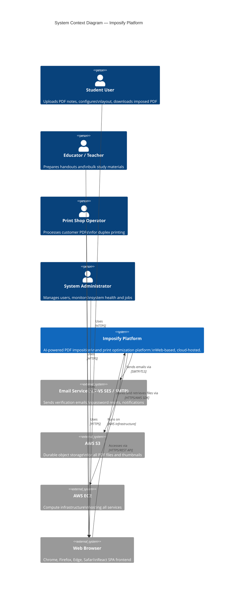

---

# PART 3: C4 CONTAINER DIAGRAM (C4 Level 2)

---

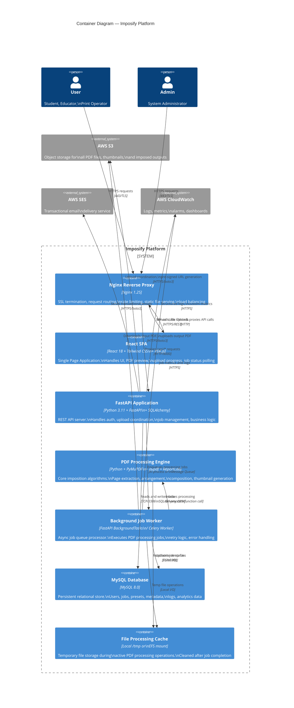

---

# PART 4: COMPONENT ARCHITECTURE (C4 Level 3)

---

## 4.1 Frontend Component Architecture

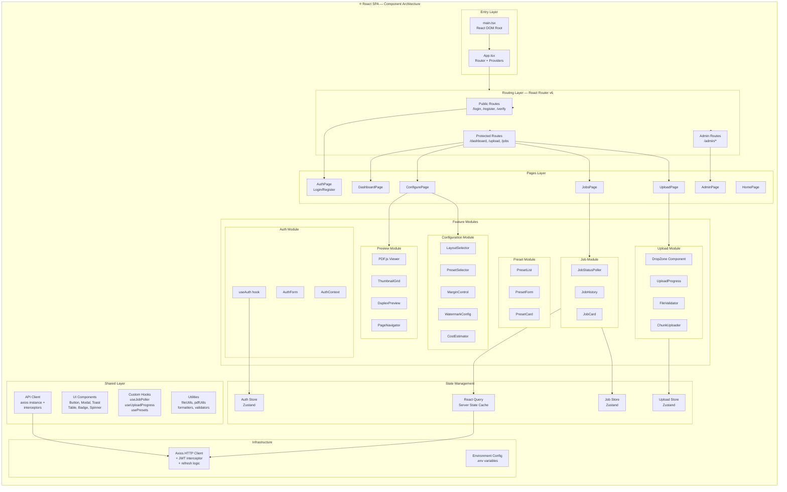

---

## 4.2 Backend Component Architecture

```mermaid
graph TB
    subgraph FASTAPI_APP["🐍 FastAPI Application — Component Architecture"]
        direction TB

        subgraph ENTRY_LAYER["Entry Layer"]
            MAIN_PY[main.py\nFastAPI App Instance\nMiddleware Setup\nRouter Registration]
            LIFESPAN[Lifespan Handler\nDB Pool Init\nS3 Client Init\nStartup/Shutdown]
        end

        subgraph MIDDLEWARE["Middleware Stack"]
            MW_CORS[CORS Middleware\nAllowed origins config]
            MW_AUTH[Auth Middleware\nJWT validation]
            MW_LOG[Request Logger\nStructured JSON logs]
            MW_RATE[Rate Limiter\nslowapi + Redis]
            MW_ERR[Error Handler\nGlobal exception handler]
        end

        subgraph ROUTERS["Router Layer — /api/v1/*"]
            R_AUTH[auth_router\n/auth/*]
            R_USERS[users_router\n/users/*]
            R_UPLOADS[uploads_router\n/uploads/*]
            R_JOBS[jobs_router\n/jobs/*]
            R_PRESETS[presets_router\n/presets/*]
            R_ANALYTICS[analytics_router\n/analytics/*]
            R_ADMIN[admin_router\n/admin/*]
            R_HEALTH[health_router\n/health]
        end

        subgraph SERVICES["Service Layer — Business Logic"]
            SVC_AUTH[AuthService\nJWT generation\nbcrypt operations\ntoken management]
            SVC_USER[UserService\nCRUD operations\nrole management]
            SVC_UPLOAD[UploadService\nmultipart coordination\nS3 operations\nvalidation]
            SVC_JOB[JobService\njob CRUD\nqueue management\nstatus tracking]
            SVC_PDF[PDFService\norchestrates engine\ncalls algorithms]
            SVC_PRESET[PresetService\npreset CRUD\nsystem preset loading]
            SVC_EMAIL[EmailService\nAWS SES integration\ntemplate rendering]
            SVC_ANALYTICS[AnalyticsService\nmetrics aggregation\nreport generation]
            SVC_STORAGE[StorageService\nS3 abstraction\npre-signed URLs\ncleanup jobs]
        end

        subgraph PDF_ENGINE["PDF Processing Engine"]
            ENG_PARSER[PDFParser\nPyMuPDF page extraction\nmetadata reading]
            ENG_ALGO[ImpositionAlgorithm\n2up/4up/9up/booklet\npage sequencing logic]
            ENG_LAYOUT[LayoutCalculator\ncell positions\nscaling factors\nmargin calculations]
            ENG_COMPOSER[PDFComposer\nReportLab canvas\nPyMuPDF rendering\nwatermark/page numbers]
            ENG_THUMB[ThumbnailGenerator\nPyMuPDF rasterize\nJPEG compression]
        end

        subgraph REPOSITORIES["Repository Layer — Data Access"]
            REPO_USER[UserRepository\nuser CRUD queries]
            REPO_UPLOAD[UploadRepository\nupload session queries]
            REPO_JOB[JobRepository\njob CRUD + status]
            REPO_META[MetadataRepository\nPDF metadata queries]
            REPO_PRESET[PresetRepository\npreset queries]
            REPO_LOG[LogRepository\nauth + download logs]
            REPO_ANALYTICS[AnalyticsRepository\naggregation queries]
        end

        subgraph MODELS["Data Models — SQLAlchemy ORM"]
            MDL_USER[User Model]
            MDL_TOKEN[RefreshToken Model]
            MDL_UPLOAD[Upload Model]
            MDL_JOB[ProcessingJob Model]
            MDL_META[PDFMetadata Model]
            MDL_PRESET[Preset Model]
            MDL_LOGS[AuditLog Model]
        end

        subgraph SCHEMAS["Pydantic Schemas — Request/Response"]
            SCH_AUTH[AuthSchemas\nRegisterRequest\nLoginResponse]
            SCH_UPLOAD[UploadSchemas\nInitiateUpload\nUploadStatus]
            SCH_JOB[JobSchemas\nCreateJob\nJobStatus\nJobResponse]
            SCH_PRESET[PresetSchemas\nPresetConfig\nCreatePreset]
        end

        subgraph WORKERS["Background Workers"]
            WORKER_PDF[PDFProcessingWorker\nexecutes imposition jobs\nretry logic]
            WORKER_THUMB[ThumbnailWorker\ngenerates thumbnails\non upload complete]
            WORKER_CLEANUP[CleanupWorker\ndeletes expired files\npurges deleted accounts]
        end

        subgraph INFRA_LAYER["Infrastructure Layer"]
            DB_SESSION[Database Session\nSQLAlchemy AsyncSession\nconnection pooling]
            S3_CLIENT[S3 Client\nboto3 wrapper\nconfigured singleton]
            CONFIG[Settings\npydantic-settings\nenvironment config]
            LOGGER[Logger\nstructured JSON\ncloudwatch handler]
        end
    end

    MAIN_PY --> MIDDLEWARE --> ROUTERS
    ROUTERS --> SERVICES
    SERVICES --> PDF_ENGINE
    SERVICES --> REPOSITORIES
    REPOSITORIES --> MODELS
    ROUTERS --> SCHEMAS
    SERVICES --> INFRA_LAYER
    WORKERS --> PDF_ENGINE
    WORKERS --> REPOSITORIES
    WORKERS --> S3_CLIENT
```

---

# PART 5: SERVICE ARCHITECTURE

---

## 5.1 Service Layer Detail

```mermaid
graph LR
    subgraph CLIENT["Client Tier"]
        BROWSER[Browser\nReact SPA]
    end

    subgraph GATEWAY["Gateway Tier"]
        NGINX[Nginx\nReverse Proxy\nSSL Termination\nRate Limiting]
    end

    subgraph APP["Application Tier"]
        API[FastAPI\nREST API Server\n:8000]
        WORKER[Job Workers\nBackground Tasks\n:8001]
    end

    subgraph DATA["Data Tier"]
        MYSQL[(MySQL 8.0\n:3306)]
        S3_IN[(S3 Bucket\nimposify-uploads\nRaw PDFs)]
        S3_OUT[(S3 Bucket\nimposify-outputs\nImposed PDFs)]
        S3_THUMB[(S3 Bucket\nimposify-thumbs\nThumbnails)]
        TMP[/tmp Volume\nTemp processing\nfiles]
    end

    subgraph EXTERNAL["External Services"]
        SES[AWS SES\nEmail]
        CW[CloudWatch\nLogs + Metrics]
    end

    BROWSER -->|HTTPS :443| NGINX
    NGINX -->|HTTP :8000| API
    NGINX -->|Static Files| BROWSER
    API -->|Job Enqueue| WORKER
    API <-->|SQLAlchemy| MYSQL
    API <-->|boto3| S3_IN
    API <-->|boto3| S3_OUT
    API <-->|boto3| S3_THUMB
    API -->|boto3| SES
    API -->|logs/metrics| CW
    WORKER <-->|SQLAlchemy| MYSQL
    WORKER <-->|boto3| S3_IN
    WORKER <-->|boto3| S3_OUT
    WORKER <-->|boto3| S3_THUMB
    WORKER <-->|Local I/O| TMP
    WORKER -->|logs/metrics| CW
```

---

## 5.2 Authentication Service Flow

```mermaid
graph TB
    subgraph AUTH_SERVICE["🔐 Authentication Service"]

        subgraph REG["Registration Flow"]
            R1[Receive Registration Request]
            R2[Validate Pydantic Schema]
            R3{Email unique?}
            R4[Hash password - bcrypt cost 12]
            R5[Generate UUID v4]
            R6[INSERT user record\nis_verified=false]
            R7[Generate verification token]
            R8[INSERT verification_tokens]
            R9[Enqueue email job]
            R10[Return 201 Created]
        end

        subgraph LOGIN["Login Flow"]
            L1[Receive Login Request]
            L2[Find user by email]
            L3{User exists\n& verified?}
            L4{Failed attempts\n< 5?}
            L5[Verify bcrypt hash]
            L6{Password\nmatches?}
            L7[Generate JWT access token\nHS256, 15min exp]
            L8[Generate refresh token\nUUID, 7day exp]
            L9[Store refresh token hash in DB]
            L10[Reset failed_attempts=0]
            L11[Log auth event]
            L12[Return tokens]
            L13[Increment failed_attempts]
            L14[Return 401]
            L15[Lock account\nfor 15 minutes]
        end

        subgraph REFRESH["Token Refresh Flow"]
            T1[Receive refresh token]
            T2[Hash incoming token]
            T3[Lookup hash in DB]
            T4{Token valid\n& not expired?}
            T5[Generate new access token]
            T6[Rotate refresh token]
            T7[Invalidate old refresh token]
            T8[Return new tokens]
            T9[Return 401 Unauthorized]
        end

        subgraph GUARD["Route Guard — Dependency"]
            G1[Extract Bearer token]
            G2[Decode JWT - verify signature]
            G3{Token in\nblocklist?}
            G4{Token\nexpired?}
            G5[Extract user_id, role]
            G6[Inject to route handler]
            G7[Return 401]
            G8[Return 403 - RBAC check]
        end
    end

    R1-->R2-->R3
    R3-->|No|R4-->R5-->R6-->R7-->R8-->R9-->R10
    R3-->|Yes|R10

    L1-->L2-->L3
    L3-->|Yes|L4
    L4-->|Yes|L5-->L6
    L6-->|Yes|L7-->L8-->L9-->L10-->L11-->L12
    L6-->|No|L13-->L14
    L4-->|No|L15-->L14
    L3-->|No|L14

    T1-->T2-->T3-->T4
    T4-->|Yes|T5-->T6-->T7-->T8
    T4-->|No|T9

    G1-->G2-->G3
    G3-->|No|G4
    G4-->|No|G5-->G6
    G3-->|Yes|G7
    G4-->|Yes|G7
    G6-->G8
```

---

## 5.3 PDF Processing Engine Architecture

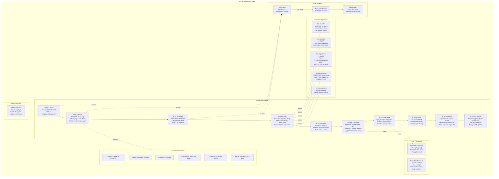

---

# PART 6: INFRASTRUCTURE ARCHITECTURE

---

## 6.1 AWS Infrastructure Architecture

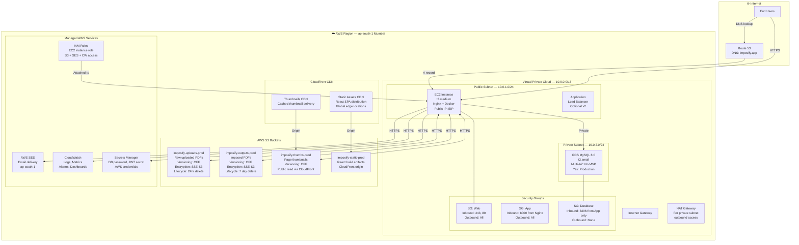

---

# PART 7: DEPLOYMENT ARCHITECTURE

---

## 7.1 Docker Compose Deployment

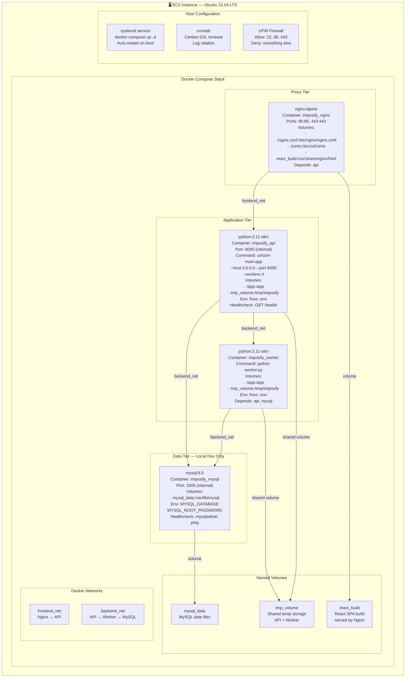

---

## 7.2 Deployment Diagram

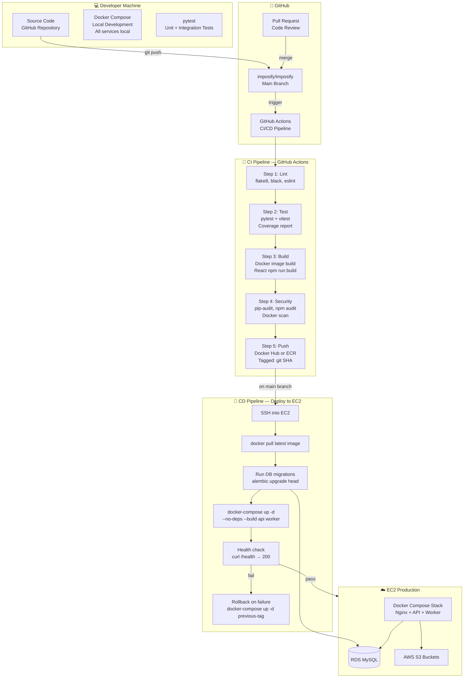

---

# PART 8: SECURITY ARCHITECTURE

---

## 8.1 Security Layers

```mermaid
graph TB
    subgraph SECURITY["🔒 Defense in Depth — Security Architecture"]

        subgraph LAYER1["Layer 1: Network Security"]
            L1A[AWS Security Groups\nWhitelist-only inbound rules]
            L1B[VPC Isolation\nPrivate subnets for DB]
            L1C[UFW Firewall\nHost-level firewall]
            L1D[TLS 1.3\nAll traffic encrypted in transit]
            L1E[HSTS Header\nForce HTTPS always]
        end

        subgraph LAYER2["Layer 2: Perimeter Security — Nginx"]
            L2A[Rate Limiting\n100 req/min authenticated\n20 req/min anonymous]
            L2B[Request Size Limit\n50MB max body]
            L2C[Security Headers\nCSP, X-Frame-Options\nX-Content-Type-Options]
            L2D[IP Blocking\nFail2ban integration]
        end

        subgraph LAYER3["Layer 3: Application Security — FastAPI"]
            L3A[JWT Validation\nEvery protected route]
            L3B[RBAC Enforcement\nRole-based route guards]
            L3C[Input Validation\nPydantic schemas all inputs]
            L3D[CORS Policy\nExplicit origin whitelist]
            L3E[CSRF Protection\nSameSite cookie flag]
        end

        subgraph LAYER4["Layer 4: Data Security"]
            L4A[bcrypt Password Hashing\ncost factor 12]
            L4B[JWT HS256\n256-bit secret minimum]
            L4C[S3 Server-Side Encryption\nSSE-S3]
            L4D[S3 Private Bucket\nNo public access]
            L4E[Pre-signed URLs\nTime-limited file access\n1 hour max]
            L4F[SQL Parameterization\nSQLAlchemy ORM\nno raw SQL]
        end

        subgraph LAYER5["Layer 5: Infrastructure Security"]
            L5A[IAM Least Privilege\nEC2 role: only S3+SES+CW]
            L5B[Secrets Manager\nNo secrets in code/env files]
            L5C[Audit Logging\nAll auth events logged]
            L5D[Dependency Scanning\npip-audit on every deploy]
        end

        subgraph THREAT_MODEL["Threat Model — OWASP Top 10 Mitigations"]
            T1[A01 Broken Access Control → RBAC + ownership checks]
            T2[A02 Cryptographic Failures → TLS + bcrypt + SSE]
            T3[A03 Injection → Pydantic + SQLAlchemy parameterized]
            T4[A04 Insecure Design → Threat modeling this document]
            T5[A05 Security Misconfiguration → Docker hardening + UFW]
            T6[A07 Auth Failures → JWT + brute force lockout]
            T7[A09 Logging Failures → Structured audit logs]
        end
    end

    LAYER1 --> LAYER2 --> LAYER3 --> LAYER4 --> LAYER5
```

---

# PART 9: DATA ARCHITECTURE

---

## 9.1 Complete Database Schema

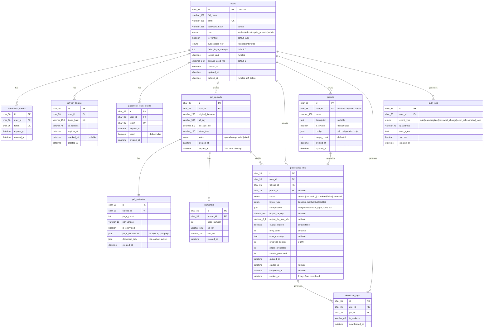

---

# PART 10: REQUEST FLOWS

---

## 10.1 Upload Flow — Complete

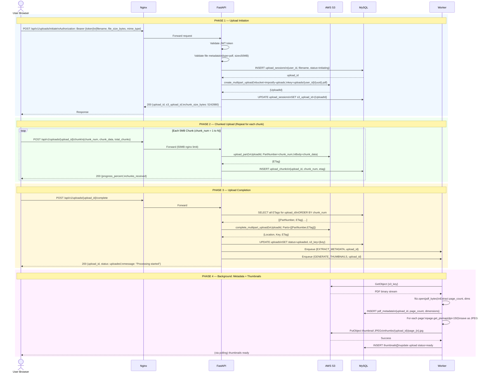

---

## 10.2 PDF Processing Flow — Complete

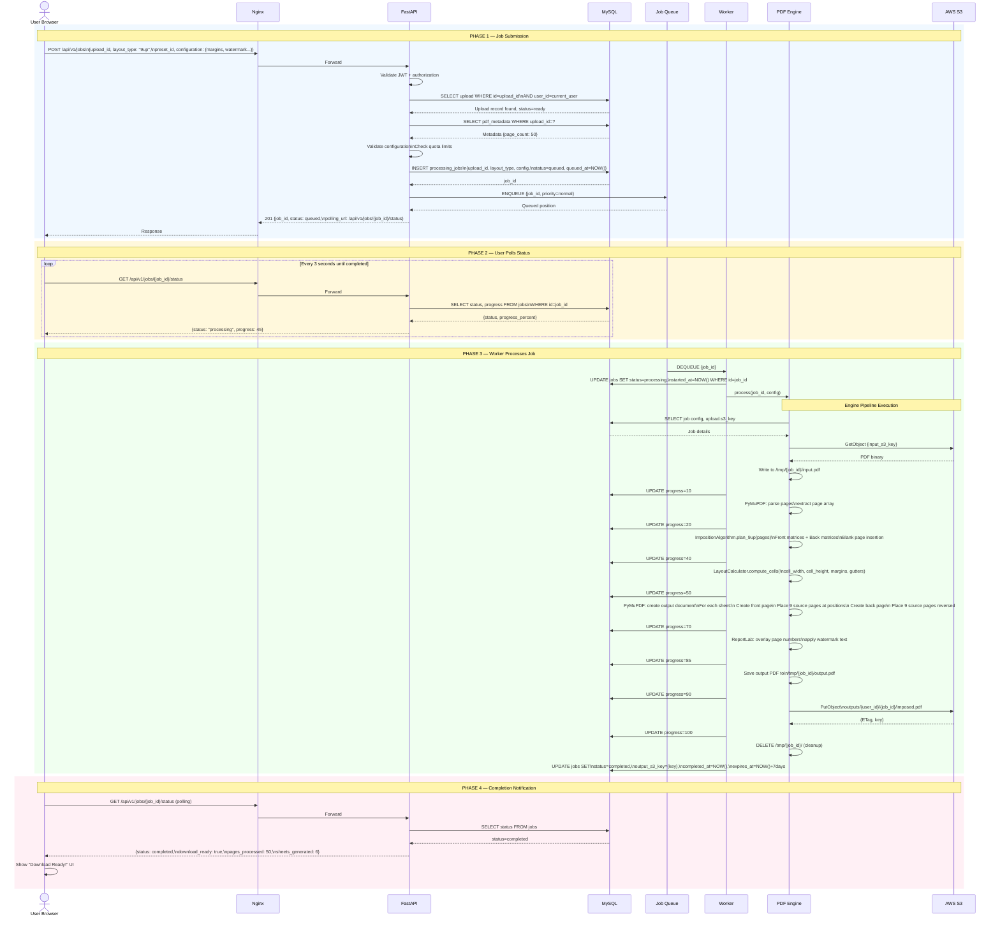

---

## 10.3 Download Flow

```mermaid
sequenceDiagram
    actor U as User Browser
    participant N as Nginx
    participant A as FastAPI
    participant DB as MySQL
    participant S3 as AWS S3

    U->>N: GET /api/v1/jobs/{job_id}/download\nAuthorization: Bearer {token}
    N->>A: Forward

    rect rgb(240, 248, 255)
        Note over A,DB: Authorization Checks

        A->>A: Decode JWT → user_id, role
        A->>DB: SELECT * FROM processing_jobs\nWHERE id=job_id
        DB-->>A: Job record

        alt Job not found
            A-->>U: 404 Not Found
        else Job belongs to different user
            A-->>U: 403 Forbidden
        else Job not completed
            A-->>U: 400 {error: "Job not yet complete", status}
        else Output expired
            A-->>U: 410 Gone {error: "Output has expired"}
        end
    end

    rect rgb(240, 255, 240)
        Note over A,S3: Pre-signed URL Generation

        A->>S3: generate_presigned_url(\nbucket=imposify-outputs,\nkey=outputs/{uid}/{job_id}/imposed.pdf,\nExpires=3600,\nResponseContentDisposition=\n"attachment; filename=imposed.pdf")
        S3-->>A: Pre-signed URL\n(signed with IAM credentials)
        A->>DB: INSERT download_logs\n{user_id, job_id, ip, timestamp}
        A-->>N: 200 {download_url, expires_in: 3600,\nfilename: "imposed_{original}.pdf",\nfile_size_mb}
        N-->>U: Response
    end

    rect rgb(255, 248, 220)
        Note over U,S3: Direct S3 Download

        U->>U: JavaScript triggers download\nwindow.location = download_url OR\nanchor.click() with href

        U->>S3: GET {pre_signed_url}\n(Direct browser to S3, bypasses our server)
        S3->>S3: Verify signature, expiry, key
        S3-->>U: PDF binary stream\nContent-Disposition: attachment\nContent-Type: application/pdf

        U->>U: Browser saves file to\ndownloads folder
    end
```

---

# PART 11: NETWORK DIAGRAM

---

```mermaid
graph TB
    subgraph INTERNET_ZONE["🌐 Internet Zone"]
        CLIENT[User Browser\n203.x.x.x]
        DNS_R53[Route 53\nimposify.app → EC2 EIP]
    end

    subgraph AWS_EDGE["☁️ AWS Edge"]
        CF[CloudFront\nEdge Locations\nStatic assets + thumbnails]
    end

    subgraph AWS_VPC["🔒 AWS VPC — 10.0.0.0/16"]

        subgraph PUBLIC_SUBNET["Public Subnet — 10.0.1.0/24"]
            direction TB
            IGW_NODE[Internet Gateway]
            EC2_NODE["EC2 Instance\nEIP: 13.x.x.x\nPrivate: 10.0.1.10\nOS: Ubuntu 22.04"]

            subgraph EC2_DOCKER["Docker Network — 172.18.0.0/16"]
                NGINX_NODE["nginx\n172.18.0.2:80,443\nPorts: 80→80, 443→443"]
                API_NODE["fastapi\n172.18.0.3:8000\nInternal only"]
                WORKER_NODE["worker\n172.18.0.4\nNo ports exposed"]
            end
        end

        subgraph PRIVATE_SUBNET["Private Subnet — 10.0.2.0/24"]
            RDS_NODE["RDS MySQL\n10.0.2.10:3306\nNo public access\nSG: allow 3306 from 10.0.1.0/24"]
            NAT_GW[NAT Gateway\n10.0.1.X — for private\nsubnet outbound]
        end

        subgraph SECURITY_GROUPS_NET["Security Group Rules"]
            SG_WEB_NET["SG-Web\nIn: 0.0.0.0/0 → 443\nIn: 0.0.0.0/0 → 80\nOut: All"]
            SG_APP_NET["SG-App (internal)\nIn: 10.0.1.0/24 → 8000\nOut: All"]
            SG_DB_NET["SG-DB\nIn: 10.0.1.0/24 → 3306 ONLY\nOut: None"]
        end
    end

    subgraph AWS_SERVICES_NET["☁️ AWS Managed Services"]
        S3_NET["S3 Endpoints\n(VPC Endpoint or public)\nbuckets: uploads, outputs, thumbs"]
        SES_NET["SES Endpoint\nemail-smtp.ap-south-1.amazonaws.com:587"]
        CW_NET["CloudWatch Endpoint\nlogs.ap-south-1.amazonaws.com"]
        SM_NET["Secrets Manager\nsecretsmanager.ap-south-1.amazonaws.com"]
    end

    CLIENT -->|DNS| DNS_R53
    DNS_R53 -->|A record| EC2_NODE
    CLIENT -->|HTTPS :443| IGW_NODE
    IGW_NODE --> EC2_NODE
    EC2_NODE --> NGINX_NODE

    NGINX_NODE -->|proxy /api/*\nHTTP :8000| API_NODE
    NGINX_NODE -->|static files\nfrom volume| CLIENT

    API_NODE -->|TCP :3306| RDS_NODE
    WORKER_NODE -->|TCP :3306| RDS_NODE

    API_NODE -->|HTTPS| S3_NET
    WORKER_NODE -->|HTTPS| S3_NET
    API_NODE -->|SMTP TLS :587| SES_NET
    API_NODE -->|HTTPS| CW_NET
    WORKER_NODE -->|HTTPS| CW_NET
    API_NODE -->|HTTPS| SM_NET

    CLIENT -->|HTTPS (cached)| CF
    CF --> S3_NET

    API_NODE -->|enqueue task| WORKER_NODE

    EC2_NODE --- SG_WEB_NET
    RDS_NODE --- SG_DB_NET
```

---

# PART 12: LAYER DESCRIPTIONS

---

## 12.1 Frontend Layer

```
FRONTEND LAYER — React SPA
══════════════════════════════════════════════════════════════

TECHNOLOGY    : React 18 + TypeScript + Tailwind CSS + PDF.js
HOSTING       : Static files served by Nginx from /usr/share/nginx/html
BUILD TOOL    : Vite (faster than CRA, native ESM)
STATE         : Zustand (lightweight, no boilerplate) +
                React Query (server state, caching, background refetch)

KEY DECISIONS:
━━━━━━━━━━━━━━━━━━━━━━━━━━━━━━━━━━━━━━━━━━━
✓ TypeScript for type safety and IDE support
✓ React Query for automatic cache invalidation and stale-while-revalidate
✓ Zustand over Redux — simpler, smaller bundle
✓ PDF.js for zero-plugin PDF preview in browser
✓ Tailwind for rapid UI development without CSS bloat
✓ Axios with request/response interceptors for automatic token refresh
✓ Vite for fast dev server HMR and optimized production builds

COMMUNICATION PATTERN:
━━━━━━━━━━━━━━━━━━━━━━━━━━━━━━━━━━━━━━━━━━━
  → REST API calls via Axios to Nginx → FastAPI
  → Polling every 3s for job status (no WebSocket in MVP)
  → Direct S3 download via pre-signed URL (zero server bandwidth)
  → Direct S3 read for PDF.js preview via pre-signed URL

PERFORMANCE OPTIMIZATIONS:
━━━━━━━━━━━━━━━━━━━━━━━━━━━━━━━━━━━━━━━━━━━
  → Code splitting by route (React.lazy + Suspense)
  → Thumbnail lazy loading (Intersection Observer)
  → Debounced preview updates (500ms) on config change
  → React Query cache: 5min stale time for job history
  → Vite chunk splitting: vendor, app, pdf-lib separate bundles
```

## 12.2 Backend Layer

```
BACKEND LAYER — FastAPI Application
══════════════════════════════════════════════════════════════

TECHNOLOGY    : Python 3.11 + FastAPI 0.110+ + SQLAlchemy 2.0
RUNTIME       : Uvicorn ASGI server, 4 workers (2× CPU cores)
ARCHITECTURE  : Layered — Routers → Services → Repositories → Models

KEY DECISIONS:
━━━━━━━━━━━━━━━━━━━━━━━━━━━━━━━━━━━━━━━━━━━
✓ FastAPI for async support, auto OpenAPI docs, Pydantic validation
✓ SQLAlchemy 2.0 async ORM for non-blocking DB queries
✓ Dependency injection for testability (pytest with override)
✓ Pydantic v2 models for input validation (all endpoints)
✓ Python-jose for JWT operations
✓ python-multipart for file upload handling

CONCURRENCY MODEL:
━━━━━━━━━━━━━━━━━━━━━━━━━━━━━━━━━━━━━━━━━━━
  → FastAPI async endpoints for I/O operations (DB, S3, email)
  → Sync endpoints for CPU-bound PDF processing (offloaded to workers)
  → 4 Uvicorn workers = 4 OS processes, each with async event loop
  → Background tasks for lightweight post-request work
  → Dedicated worker process for heavy PDF processing

MIDDLEWARE EXECUTION ORDER:
━━━━━━━━━━━━━━━━━━━━━━━━━━━━━━━━━━━━━━━━━━━
  1. CORS check
  2. Rate limiter check (slowapi)
  3. Request logger (log method, path, user_agent, ip)
  4. JWT validation (for protected routes via Depends())
  5. Route handler execution
  6. Response logger (log status, duration)
  7. Global error handler (catch unhandled exceptions → 500)
```

## 12.3 Database Layer

```
DATABASE LAYER — MySQL 8.0
══════════════════════════════════════════════════════════════

TECHNOLOGY    : MySQL 8.0 + SQLAlchemy 2.0 ORM + Alembic migrations
DEPLOYMENT    : AWS RDS (production) or Docker (development)

KEY DECISIONS:
━━━━━━━━━━━━━━━━━━━━━━━━━━━━━━━━━━━━━━━━━━━
✓ MySQL 8.0 for JSON column support, window functions, UUID functions
✓ Alembic for schema migration management (version-controlled)
✓ SQLAlchemy async session with connection pooling
✓ UUID v4 as primary keys (no sequential ID exposure)
✓ Soft delete pattern for user accounts (deleted_at timestamp)
✓ Composite indexes on frequently queried columns

CONNECTION POOLING:
━━━━━━━━━━━━━━━━━━━━━━━━━━━━━━━━━━━━━━━━━━━
  pool_size=5, max_overflow=15, pool_timeout=30s
  pool_pre_ping=True (test connections before use)
  pool_recycle=3600 (recycle connections every 1hr)

KEY INDEXES:
━━━━━━━━━━━━━━━━━━━━━━━━━━━━━━━━━━━━━━━━━━━
  users.email (UNIQUE INDEX)
  processing_jobs.user_id + status (COMPOSITE)
  processing_jobs.queued_at (for worker polling)
  refresh_tokens.token_hash (UNIQUE INDEX)
  thumbnails.upload_id + page_number (COMPOSITE)
  download_logs.user_id + downloaded_at (COMPOSITE)
```

## 12.4 Storage Layer

```
STORAGE LAYER — AWS S3
══════════════════════════════════════════════════════════════

BUCKETS STRUCTURE:
━━━━━━━━━━━━━━━━━━━━━━━━━━━━━━━━━━━━━━━━━━━

  imposify-uploads-{env}
  ├── uploads/{user_id}/{upload_uuid}/original.pdf
  └── [Lifecycle: Delete after 24 hours]

  imposify-outputs-{env}
  ├── outputs/{user_id}/{job_id}/imposed.pdf
  └── [Lifecycle: Delete after 7 days (free tier)]

  imposify-thumbs-{env}
  ├── thumbs/{upload_id}/page_001.jpg
  ├── thumbs/{upload_id}/page_002.jpg
  └── [Lifecycle: Delete after 48 hours]

  imposify-static-{env}
  ├── (React build artifacts — index.html, JS bundles, CSS)
  └── [CloudFront origin, indefinite retention]

ACCESS PATTERNS:
━━━━━━━━━━━━━━━━━━━━━━━━━━━━━━━━━━━━━━━━━━━
  → Uploads: PUT via multipart (backend coordinated)
  → Worker reads: GetObject (backend internal)
  → Worker writes: PutObject (backend internal)
  → User download: Pre-signed GET URL (1hr expiry)
  → PDF.js preview: Pre-signed GET URL (30min expiry)
  → Thumbnails: CloudFront CDN URL (cached, public read)

SECURITY:
━━━━━━━━━━━━━━━━━━━━━━━━━━━━━━━━━━━━━━━━━━━
  → All buckets: Block Public Access = ENABLED
  → Encryption: SSE-S3 (AES-256) at rest
  → Access: Only via EC2 IAM role or pre-signed URLs
  → Bucket Policy: Deny all non-IAM access
```

---

# PART 13: SCALABILITY STRATEGY

---

```mermaid
graph TB
    subgraph SCALING["📈 Scaling Strategy — Progressive Architecture"]

        subgraph MVP["Phase 1: MVP — Single EC2"]
            M1[Single EC2 t3.medium\nAll services on one instance\nDocker Compose]
            M2[MySQL on RDS t3.small\nSingle AZ]
            M3[FastAPI 4 workers\nBackground tasks]
            M4[Target: 100 concurrent users]
        end

        subgraph V2["Phase 2: V2 — Horizontal Scale"]
            V2A[EC2 Auto Scaling Group\n2-4 instances t3.large\nbehind ALB]
            V2B[RDS MySQL Multi-AZ\nRead Replica for analytics]
            V2C[Celery + Redis\nDedicated job workers 2x]
            V2D[ElastiCache Redis\nRate limiting + token blocklist]
            V2E[Target: 2000 concurrent users]
        end

        subgraph V3["Phase 3: Production SaaS"]
            V3A[Microservices Split\nAuth Service\nUpload Service\nProcessing Service\nNotification Service]
            V3B[AWS ECS Fargate\nContainer orchestration\nAuto-scaling per service]
            V3C[RDS Aurora MySQL\nServerless v2\nAuto-scaling storage]
            V3D[SQS + Lambda\nEvent-driven processing\nPay-per-use]
            V3E[Target: 50K concurrent users]
        end

        subgraph STATELESS["Statelessness Principles — Enable All Phases"]
            S1[JWT auth — no server session]
            S2[S3 storage — no local files after processing]
            S3_STATE[DB for all persistent state]
            S4[Env vars for all config]
            S5[No in-memory caching across requests]
        end
    end

    MVP -->|Scale triggers:\nCPU > 70% sustained\nor p95 latency > 500ms| V2
    V2 -->|Scale triggers:\nUser growth > 5K\nor business model validated| V3
    STATELESS -.->|enables| MVP & V2 & V3
```

---

# PART 14: CACHING STRATEGY

---

```mermaid
graph TB
    subgraph CACHE["⚡ Multi-Layer Caching Strategy"]

        subgraph L1["Layer 1: Browser Cache — Client Side"]
            B1[React Query Cache\nServer state: 5min stale\nBackground refetch]
            B2[Job Status Cache\nInvalidated on completion]
            B3[Preset List Cache\nStale: 10min\nRefetch on window focus]
            B4[Static Asset Cache\nNginx: max-age=31536000\nFor versioned JS/CSS]
        end

        subgraph L2["Layer 2: CDN Cache — CloudFront"]
            C1[Static React App\nCache-Control: immutable\n1 year TTL (versioned filenames)]
            C2[Page Thumbnails\nCache-Control: max-age=3600\nCDN cached globally]
        end

        subgraph L3["Layer 3: Application Cache — FastAPI"]
            A1[System Presets\nIn-memory on startup\nDict lookup — no DB hit]
            A2[User Profile Cache\nNone in MVP\nRedis in V2]
            A3[Rate Limit Counters\nIn-memory (MVP)\nRedis (V2)]
        end

        subgraph L4["Layer 4: Database Query Cache"]
            D1[MySQL Query Cache\n(disabled in MySQL 8.0)\nUse application-level instead]
            D2[SQLAlchemy Connection Pool\nReuse DB connections\nNo reconnect overhead]
            D3[Indexed Lookups\nAvoid full table scans\nCover indexes for hot queries]
        end

        subgraph CACHE_KEYS["Cache Key Patterns"]
            K1[job_status:{job_id} → TTL 3s]
            K2[user_profile:{user_id} → TTL 300s]
            K3[preset_list:{user_id} → TTL 600s]
            K4[rate_limit:{ip}:{endpoint} → TTL 60s]
        end

        subgraph INVALIDATION["Cache Invalidation"]
            I1[Job completed → invalidate job_status]
            I2[Profile updated → invalidate user_profile]
            I3[Preset created → invalidate preset_list]
            I4[Logout → add JWT to blocklist cache]
        end
    end

    L1 --> L2 --> L3 --> L4
    CACHE_KEYS -.->|used by| L3
    INVALIDATION -.->|applied to| L1 & L3
```

---

# PART 15: LOGGING STRATEGY

---

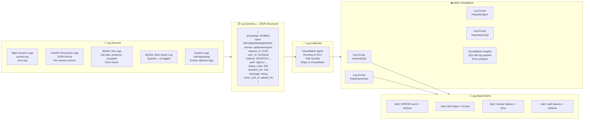

---

# PART 16: MONITORING STRATEGY

---

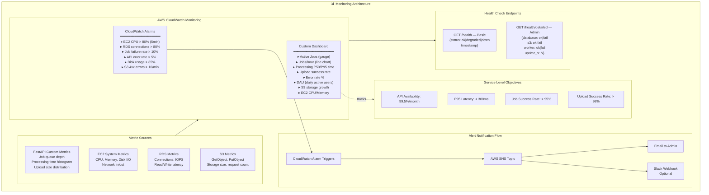

---

# PART 17: DISASTER RECOVERY STRATEGY

---

```mermaid
graph TB
    subgraph DR["🆘 Disaster Recovery Strategy"]

        subgraph FAILURE_SCENARIOS["Failure Scenarios and RTO/RPO"]
            FS1["Scenario 1: EC2 Instance Failure\nRTO: 15 minutes\nRPO: 0 (stateless)\nAction: Launch new EC2 from AMI\nRestore: docker-compose up"]

            FS2["Scenario 2: RDS Database Failure\nRTO: 30 minutes\nRPO: 24 hours (daily backup)\nAction: Restore from RDS snapshot\nMVP: Manual  |  Prod: Multi-AZ auto"]

            FS3["Scenario 3: Data Corruption\nRTO: 1 hour\nRPO: 24 hours\nAction: Point-in-time restore\nfrom RDS automated backup"]

            FS4["Scenario 4: S3 Data Loss\nRTO: N/A (11-nine durability)\nRPO: N/A\nNote: S3 is source of truth\nfor all files — extremely unlikely"]

            FS5["Scenario 5: Complete Region Failure\nRTO: 4 hours (manual)\nRPO: 24 hours\nAction: Deploy to backup region\nfrom AMI + RDS snapshot cross-region"]
        end

        subgraph BACKUP["Backup Strategy"]
            BK1[RDS Automated Backup\nDaily full backup\n7-day retention\nEnabled by default on RDS]
            BK2[Database Schema\nAlembic migrations in Git\nRecreatable from scratch]
            BK3[EC2 AMI Snapshot\nWeekly AMI creation\nIncludes Docker config\nNginx SSL certs]
            BK4[Config in Git\ndocker-compose.yml\nnginx.conf\nalembic.ini\nAll IaC in repo]
            BK5[S3 Cross-Region Replication\nOptional for production\nReplicates to ap-southeast-1]
        end

        subgraph RUNBOOKS["Recovery Runbooks"]
            RB1["Runbook 1: EC2 Recovery\n1. Launch EC2 from saved AMI\n2. Attach Elastic IP\n3. Configure .env from Secrets Manager\n4. docker-compose up -d\n5. Verify /health endpoint\n6. Update Route53 if needed"]

            RB2["Runbook 2: DB Recovery\n1. Go to RDS console\n2. Select snapshot\n3. Restore to new instance\n4. Update DB_URL env var\n5. Run alembic upgrade head\n6. Restart API containers"]

            RB3["Runbook 3: Full Stack Recovery\n1. DB recovery (Runbook 2)\n2. EC2 recovery (Runbook 1)\n3. Verify all health checks\n4. Run smoke test suite\n5. Notify users via email"]
        end
    end
```

---

# PART 18: CI/CD STRATEGY

---

```mermaid
graph LR
    subgraph DEV_FLOW["💻 Development Flow"]
        LOCAL[Local Dev\ndocker-compose up\nHot reload via volumes]
        COMMIT[git commit\nPre-commit hooks:\n- black formatter\n- flake8 linter\n- mypy type check\n- eslint + prettier]
        PR[Pull Request\nto main branch]
    end

    subgraph CI_PIPELINE["🔄 CI Pipeline — GitHub Actions: ci.yml"]
        direction TB
        TRIGGER[Trigger: PR to main\nor push to main]

        JOB1["Job 1: Backend Tests\n━━━━━━━━━━━━━━━━\n1. Setup Python 3.11\n2. pip install -r requirements.txt\n3. black --check app/\n4. flake8 app/\n5. mypy app/\n6. pytest tests/ --cov=app\n   --cov-report=xml\n7. Upload coverage to Codecov"]

        JOB2["Job 2: Frontend Tests\n━━━━━━━━━━━━━━━━\n1. Setup Node 20\n2. npm ci\n3. npx eslint src/\n4. npx tsc --noEmit\n5. npm test -- --coverage\n6. npm run build\n   (verify build succeeds)"]

        JOB3["Job 3: Security Scan\n━━━━━━━━━━━━━━━━\n1. pip-audit (Python CVEs)\n2. npm audit --audit-level=high\n3. docker build --no-cache\n4. trivy image scan\n   (container vulnerabilities)"]

        JOB4["Job 4: Docker Build\n━━━━━━━━━━━━━━━━\n1. Build API image\n2. Build Worker image\n3. Tag with git SHA\n4. Push to Docker Hub\n   (only on main branch)"]

        TRIGGER --> JOB1 & JOB2
        JOB1 & JOB2 --> JOB3
        JOB3 --> JOB4
    end

    subgraph CD_PIPELINE["🚀 CD Pipeline — GitHub Actions: deploy.yml"]
        direction TB
        CD_TRIGGER[Trigger: Push to main\nafter CI passes]

        CD1["Step 1: Notify\nPost to Slack: Deployment starting"]

        CD2["Step 2: SSH to EC2\nusing GitHub Secrets:\n- EC2_HOST\n- EC2_KEY\n- EC2_USER"]

        CD3["Step 3: Pull Images\ndocker pull imposify/api:{SHA}\ndocker pull imposify/worker:{SHA}"]

        CD4["Step 4: Database Migration\ndocker-compose run --rm api\nalembic upgrade head"]

        CD5["Step 5: Rolling Update\ndocker-compose up -d\n--no-deps --build api\nwait 10s\ndocker-compose up -d\n--no-deps --build worker"]

        CD6["Step 6: Health Check\nfor i in 1..5: sleep 10\n  curl /health → 200\nif fail: goto ROLLBACK"]

        CD7["Step 7: Smoke Tests\nGET /health → 200\nPOST /auth/login → 200\nGET /presets → 200"]

        CD8["Step 8: Success\nPost to Slack: ✅ Deployed {SHA}"]

        ROLLBACK["ROLLBACK:\ndocker-compose up -d\n--no-deps api:{PREV_SHA}\ndocker-compose up -d\n--no-deps worker:{PREV_SHA}\nPost to Slack: ⚠️ Rollback executed"]

        CD_TRIGGER --> CD1 --> CD2 --> CD3 --> CD4 --> CD5 --> CD6
        CD6 -->|pass| CD7 --> CD8
        CD6 -->|fail| ROLLBACK
        CD7 -->|fail| ROLLBACK
    end

    subgraph ENV["🌍 Environments"]
        ENV_DEV[Development\ndocker-compose local\n.env.development]
        ENV_STAGING[Staging (Optional)\nEC2 t3.small\n.env.staging]
        ENV_PROD[Production\nEC2 t3.medium+\n.env.production]
    end

    LOCAL --> COMMIT --> PR
    PR --> CI_PIPELINE
    CI_PIPELINE -->|merged to main| CD_PIPELINE
    CD_PIPELINE --> ENV_PROD
```

---

# PART 19: FOLDER STRUCTURE

---

```
imposify/
│
├── 📁 frontend/                          # React SPA
│   ├── public/
│   │   ├── index.html
│   │   └── favicon.ico
│   ├── src/
│   │   ├── main.tsx                      # React DOM entry point
│   │   ├── App.tsx                       # Router + global providers
│   │   ├── vite-env.d.ts
│   │   │
│   │   ├── 📁 pages/                     # Route-level page components
│   │   │   ├── HomePage.tsx
│   │   │   ├── AuthPage.tsx
│   │   │   ├── DashboardPage.tsx
│   │   │   ├── UploadPage.tsx
│   │   │   ├── ConfigurePage.tsx
│   │   │   ├── JobsPage.tsx
│   │   │   ├── ProfilePage.tsx
│   │   │   └── admin/
│   │   │       ├── AdminDashboard.tsx
│   │   │       ├── UserManagement.tsx
│   │   │       └── JobQueuePage.tsx
│   │   │
│   │   ├── 📁 features/                  # Feature-first modules
│   │   │   ├── auth/
│   │   │   │   ├── components/
│   │   │   │   │   ├── LoginForm.tsx
│   │   │   │   │   └── RegisterForm.tsx
│   │   │   │   ├── hooks/
│   │   │   │   │   └── useAuth.ts
│   │   │   │   ├── store/
│   │   │   │   │   └── authStore.ts      # Zustand auth store
│   │   │   │   └── api/
│   │   │   │       └── authApi.ts
│   │   │   │
│   │   │   ├── upload/
│   │   │   │   ├── components/
│   │   │   │   │   ├── DropZone.tsx
│   │   │   │   │   ├── UploadProgress.tsx
│   │   │   │   │   └── FileValidation.tsx
│   │   │   │   ├── hooks/
│   │   │   │   │   └── useChunkUpload.ts
│   │   │   │   └── api/
│   │   │   │       └── uploadApi.ts
│   │   │   │
│   │   │   ├── preview/
│   │   │   │   ├── components/
│   │   │   │   │   ├── PDFViewer.tsx     # PDF.js wrapper
│   │   │   │   │   ├── ThumbnailGrid.tsx
│   │   │   │   │   ├── DuplexPreview.tsx
│   │   │   │   │   └── PageNavigator.tsx
│   │   │   │   └── hooks/
│   │   │   │       └── usePDFViewer.ts
│   │   │   │
│   │   │   ├── configuration/
│   │   │   │   ├── components/
│   │   │   │   │   ├── LayoutSelector.tsx
│   │   │   │   │   ├── PresetSelector.tsx
│   │   │   │   │   ├── MarginControl.tsx
│   │   │   │   │   ├── WatermarkConfig.tsx
│   │   │   │   │   └── CostEstimator.tsx
│   │   │   │   └── hooks/
│   │   │   │       └── useConfiguration.ts
│   │   │   │
│   │   │   ├── jobs/
│   │   │   │   ├── components/
│   │   │   │   │   ├── JobStatusCard.tsx
│   │   │   │   │   ├── JobHistory.tsx
│   │   │   │   │   └── ProgressBar.tsx
│   │   │   │   ├── hooks/
│   │   │   │   │   └── useJobPoller.ts   # Polling hook
│   │   │   │   ├── store/
│   │   │   │   │   └── jobStore.ts
│   │   │   │   └── api/
│   │   │   │       └── jobsApi.ts
│   │   │   │
│   │   │   └── presets/
│   │   │       ├── components/
│   │   │       │   ├── PresetList.tsx
│   │   │       │   └── PresetForm.tsx
│   │   │       └── api/
│   │   │           └── presetsApi.ts
│   │   │
│   │   ├── 📁 shared/                    # Reusable across features
│   │   │   ├── components/
│   │   │   │   ├── Button.tsx
│   │   │   │   ├── Modal.tsx
│   │   │   │   ├── Toast.tsx
│   │   │   │   ├── Spinner.tsx
│   │   │   │   ├── Badge.tsx
│   │   │   │   ├── Table.tsx
│   │   │   │   ├── Card.tsx
│   │   │   │   └── ProtectedRoute.tsx
│   │   │   ├── hooks/
│   │   │   │   ├── useDebounce.ts
│   │   │   │   └── useLocalStorage.ts
│   │   │   └── utils/
│   │   │       ├── fileUtils.ts
│   │   │       ├── formatters.ts
│   │   │       └── validators.ts
│   │   │
│   │   ├── 📁 api/                       # API client layer
│   │   │   ├── client.ts                 # Axios instance + interceptors
│   │   │   └── endpoints.ts              # URL constants
│   │   │
│   │   ├── 📁 types/                     # TypeScript type definitions
│   │   │   ├── auth.types.ts
│   │   │   ├── job.types.ts
│   │   │   ├── upload.types.ts
│   │   │   └── preset.types.ts
│   │   │
│   │   └── 📁 config/
│   │       └── env.ts                    # Typed env variables
│   │
│   ├── package.json
│   ├── vite.config.ts
│   ├── tsconfig.json
│   ├── tailwind.config.js
│   └── Dockerfile                        # Multi-stage: build + nginx
│
├── 📁 backend/                           # FastAPI Application
│   ├── main.py                           # FastAPI app entry
│   ├── worker.py                         # Worker entry point
│   │
│   ├── 📁 app/
│   │   ├── __init__.py
│   │   │
│   │   ├── 📁 api/                       # Router layer
│   │   │   ├── __init__.py
│   │   │   ├── deps.py                   # Shared dependencies (get_current_user)
│   │   │   └── v1/
│   │   │       ├── __init__.py
│   │   │       ├── auth.py
│   │   │       ├── users.py
│   │   │       ├── uploads.py
│   │   │       ├── jobs.py
│   │   │       ├── presets.py
│   │   │       ├── analytics.py
│   │   │       ├── admin.py
│   │   │       └── health.py
│   │   │
│   │   ├── 📁 services/                  # Business logic layer
│   │   │   ├── auth_service.py
│   │   │   ├── user_service.py
│   │   │   ├── upload_service.py
│   │   │   ├── job_service.py
│   │   │   ├── pdf_service.py            # Orchestrates PDF engine
│   │   │   ├── preset_service.py
│   │   │   ├── email_service.py
│   │   │   ├── storage_service.py        # S3 abstraction
│   │   │   └── analytics_service.py
│   │   │
│   │   ├── 📁 pdf_engine/                # Core PDF Processing
│   │   │   ├── __init__.py
│   │   │   ├── orchestrator.py           # Job pipeline coordinator
│   │   │   ├── parser.py                 # PyMuPDF + pypdf parser
│   │   │   ├── algorithms/
│   │   │   │   ├── __init__.py
│   │   │   │   ├── base.py               # Abstract base algorithm
│   │   │   │   ├── two_up.py
│   │   │   │   ├── four_up.py
│   │   │   │   ├── nine_up.py            # Core algorithm ⭐
│   │   │   │   └── booklet.py
│   │   │   ├── layout_calculator.py      # Cell positions, scaling
│   │   │   ├── composer.py               # PyMuPDF page placement
│   │   │   ├── decorator.py              # Watermark, page numbers (ReportLab)
│   │   │   └── thumbnail_generator.py
│   │   │
│   │   ├── 📁 repositories/              # Data access layer
│   │   │   ├── user_repository.py
│   │   │   ├── upload_repository.py
│   │   │   ├── job_repository.py
│   │   │   ├── metadata_repository.py
│   │   │   ├── preset_repository.py
│   │   │   └── log_repository.py
│   │   │
│   │   ├── 📁 models/                    # SQLAlchemy ORM models
│   │   │   ├── __init__.py
│   │   │   ├── base.py                   # Base with id, created_at, updated_at
│   │   │   ├── user.py
│   │   │   ├── token.py
│   │   │   ├── upload.py
│   │   │   ├── job.py
│   │   │   ├── preset.py
│   │   │   └── log.py
│   │   │
│   │   ├── 📁 schemas/                   # Pydantic request/response
│   │   │   ├── auth.py
│   │   │   ├── user.py
│   │   │   ├── upload.py
│   │   │   ├── job.py
│   │   │   └── preset.py
│   │   │
│   │   ├── 📁 workers/                   # Background job handlers
│   │   │   ├── pdf_worker.py             # Main PDF processing worker
│   │   │   ├── thumbnail_worker.py
│   │   │   └── cleanup_worker.py
│   │   │
│   │   ├── 📁 core/                      # Framework infrastructure
│   │   │   ├── config.py                 # pydantic-settings Settings class
│   │   │   ├── database.py               # AsyncSession factory
│   │   │   ├── security.py               # JWT, bcrypt helpers
│   │   │   ├── logging.py                # Structured JSON logger
│   │   │   ├── exceptions.py             # Custom exception classes
│   │   │   └── middleware.py             # Custom middleware
│   │   │
│   │   └── 📁 utils/
│   │       ├── s3_utils.py
│   │       ├── email_templates.py
│   │       └── validators.py
│   │
│   ├── 📁 migrations/                    # Alembic migrations
│   │   ├── env.py
│   │   ├── script.py.mako
│   │   └── versions/
│   │       ├── 001_create_users.py
│   │       ├── 002_create_uploads.py
│   │       ├── 003_create_jobs.py
│   │       └── 004_create_presets.py
│   │
│   ├── 📁 tests/
│   │   ├── conftest.py                   # pytest fixtures
│   │   ├── 📁 unit/
│   │   │   ├── test_auth_service.py
│   │   │   ├── test_pdf_algorithms.py    # Core algorithm tests ⭐
│   │   │   ├── test_layout_calculator.py
│   │   │   └── test_schemas.py
│   │   └── 📁 integration/
│   │       ├── test_auth_api.py
│   │       ├── test_upload_api.py
│   │       └── test_jobs_api.py
│   │
│   ├── requirements.txt
│   ├── requirements-dev.txt
│   ├── alembic.ini
│   ├── pyproject.toml                    # black, isort, mypy config
│   └── Dockerfile
│
├── 📁 nginx/                             # Nginx configuration
│   ├── nginx.conf                        # Main nginx config
│   ├── conf.d/
│   │   └── imposify.conf                 # Server block
│   └── ssl/                             # SSL certs (gitignored)
│
├── 📁 infrastructure/                    # IaC and deployment
│   ├── docker-compose.yml               # Production compose
│   ├── docker-compose.dev.yml           # Development override
│   ├── docker-compose.test.yml          # Test environment
│   └── scripts/
│       ├── deploy.sh                     # Manual deploy script
│       ├── backup_db.sh                  # DB backup script
│       └── health_check.sh              # Post-deploy health check
│
├── 📁 .github/
│   └── workflows/
│       ├── ci.yml                        # CI pipeline
│       └── deploy.yml                    # CD pipeline
│
├── 📁 docs/
│   ├── SRS.md                            # This SRS document
│   ├── architecture.md                   # This architecture document
│   ├── api.md                            # API documentation
│   ├── runbooks/
│   │   ├── ec2-recovery.md
│   │   ├── db-recovery.md
│   │   └── rollback.md
│   └── adr/                              # Architecture Decision Records
│       ├── ADR-001-monolith.md
│       ├── ADR-002-async-jobs.md
│       └── ADR-003-s3-storage.md
│
├── .env.example                          # Template for env vars
├── .gitignore
├── README.md
└── Makefile                              # Developer shortcuts
```

---

# PART 20: MICROSERVICE READINESS

---

```mermaid
graph TB
    subgraph MONOLITH["📦 Current: Modular Monolith"]
        direction TB
        MOD1[Auth Module\napp/api/v1/auth.py\napp/services/auth_service.py]
        MOD2[Upload Module\napp/api/v1/uploads.py\napp/services/upload_service.py]
        MOD3[Job Module\napp/api/v1/jobs.py\napp/services/job_service.py]
        MOD4[PDF Engine\napp/pdf_engine/*]
        MOD5[Preset Module\napp/api/v1/presets.py]
        MOD6[Analytics Module\napp/api/v1/analytics.py]
        MOD7[Notification Module\napp/services/email_service.py]

        SHARED_DB[(Shared MySQL DB\nAll tables in one schema)]
    end

    subgraph READINESS["✅ Microservice Readiness Design"]
        R1[Module boundaries enforced\nNo cross-module direct imports]
        R2[Service interfaces\nclearly defined]
        R3[Database accessed\nonly via repositories\nnot directly]
        R4[Config externalized\nto environment variables]
        R5[Auth is stateless\nJWT contains all claims]
        R6[File storage\ncentral S3 — no local state]
        R7[Communication pattern\ndocumented — internal calls\nmimics REST contracts]
    end

    subgraph FUTURE_MICROSERVICES["🔮 Future: Microservices Split (V3)"]
        direction TB
        MS1["auth-service\nFastAPI :8001\nOwns: users, tokens tables\nExposes: /auth/* /users/*"]
        MS2["upload-service\nFastAPI :8002\nOwns: uploads, metadata, thumbs\nExposes: /uploads/*"]
        MS3["processing-service\nFastAPI :8003 + Workers\nOwns: processing_jobs\nExposes: /jobs/*\nConsumes: SQS queue"]
        MS4["preset-service\nFastAPI :8004\nOwns: presets\nExposes: /presets/*"]
        MS5["notification-service\nFastAPI :8005\nOwns: email queue\nSNS/SES consumer"]
        MS6["analytics-service\nFastAPI :8006\nOwns: analytics tables\nRead replicas only"]

        API_GW[AWS API Gateway\nor Kong API Gateway\nRoute → /auth → auth-service\nRoute → /jobs → processing-service]

        DB_AUTH[(Auth DB\nMySQL)]
        DB_UPLOAD[(Upload DB\nMySQL)]
        DB_JOBS[(Jobs DB\nMySQL)]
        DB_ANALYTICS[(Analytics DB\nPostgres + TimescaleDB)]

        MS1 --> DB_AUTH
        MS2 --> DB_UPLOAD
        MS3 --> DB_JOBS
        MS6 --> DB_ANALYTICS
        API_GW --> MS1 & MS2 & MS3 & MS4 & MS5 & MS6
    end

    MONOLITH -->|Phase 3\n1000+ users| FUTURE_MICROSERVICES
    READINESS -.->|enabled by| MONOLITH
    READINESS -.->|facilitates| FUTURE_MICROSERVICES
```

---

# PART 21: FUTURE MIGRATION PATH

---

```mermaid
graph LR
    subgraph NOW["📅 Now — MVP (Month 1-3)"]
        direction TB
        N1["Single EC2 t3.medium\nDocker Compose\nAll services"]
        N2["RDS MySQL Single AZ\nt3.small"]
        N3["FastAPI Background Tasks\n(in-process async)"]
        N4["S3 Standard\n3 buckets"]
        N5["Route 53 + Nginx\nBasic routing"]
        N6["CloudWatch\nBasic metrics"]
    end

    subgraph GROWTH["📈 Growth Phase (Month 4-8)"]
        direction TB
        G1["EC2 Auto Scaling Group\n2-4 instances\nApplication Load Balancer"]
        G2["RDS MySQL Multi-AZ\nRead Replica\nfor analytics"]
        G3["Celery + Redis\nDedicated worker fleet\n2-4 worker instances"]
        G4["CloudFront CDN\nfor static assets\n+ thumbnails"]
        G5["ElastiCache Redis\nRate limiting\nToken blocklist\nSession cache"]
        G6["CloudWatch Dashboards\nSNS Alerts\nSLO monitoring"]
    end

    subgraph SCALE["🚀 Scale Phase (Month 9+)"]
        direction TB
        S1["AWS ECS Fargate\nContainer orchestration\nAuto-scaling per service"]
        S2["Aurora MySQL Serverless v2\nAuto-scaling\nGlobal reads"]
        S3["SQS + ECS Workers\nEvent-driven processing\nDead Letter Queue"]
        S4["S3 Intelligent Tiering\n+ Cross-region replication"]
        S5["Microservices Split\nAuth, Upload, Processing\nNotification, Analytics"]
        S6["AWS X-Ray\nDistributed tracing\nFull observability"]
        S7["API Gateway\nThrotting, WAF\nUsage plans"]
    end

    subgraph TECH_UPGRADES["🔧 Technical Upgrade Path"]
        TU1[FastAPI BackgroundTasks\n↓\nCelery + Redis\n↓\nAWS SQS]
        TU2[MySQL Single\n↓\nMySQL Multi-AZ\n↓\nAurora Serverless]
        TU3[EC2 Docker\n↓\nEC2 + ALB\n↓\nECS Fargate]
        TU4[Monolith\n↓\nModular Monolith\n↓\nMicroservices]
    end

    NOW -->|Traffic growth\nCPU alerts| GROWTH
    GROWTH -->|Business validated\nUser surge| SCALE
    TU1 & TU2 & TU3 & TU4 -.->|guides| NOW
    TU1 & TU2 & TU3 & TU4 -.->|guides| GROWTH
    TU1 & TU2 & TU3 & TU4 -.->|guides| SCALE
```

---

# ARCHITECTURE SUMMARY

---

```
╔══════════════════════════════════════════════════════════════════════╗
║              IMPOSIFY — ARCHITECTURE SUMMARY CARD                    ║
╠══════════════════════════════════════════════════════════════════════╣
║                                                                      ║
║  PATTERN        : Modular Monolith → Microservices Ready            ║
║  DEPLOYMENT     : Docker Compose on AWS EC2 + RDS + S3             ║
║  SCALE TARGET   : MVP 100 users → V2 2000 → V3 50K users           ║
║                                                                      ║
╠══════════════════════════════════════════════════════════════════════╣
║  FRONTEND       React 18 + TypeScript + Tailwind + PDF.js           ║
║                 Vite build + Nginx serve + CloudFront CDN           ║
║  BACKEND        FastAPI + SQLAlchemy 2.0 + Pydantic v2             ║
║                 4 Uvicorn workers + Background task workers         ║
║  DATABASE       MySQL 8.0 on RDS + Alembic migrations              ║
║  STORAGE        AWS S3 (3 buckets) + CloudFront CDN                ║
║  AUTH           JWT HS256 (15min) + Rotating Refresh (7d)          ║
║  PDF ENGINE     PyMuPDF + pypdf + ReportLab pipeline               ║
║  EMAIL          AWS SES transactional email                         ║
║  MONITORING     CloudWatch Logs + Metrics + Alarms + Dashboards    ║
║  SECURITY       TLS + JWT + bcrypt + RBAC + Pre-signed S3 URLs     ║
║  CI/CD          GitHub Actions → Docker Hub → EC2 rolling deploy   ║
║                                                                      ║
╠══════════════════════════════════════════════════════════════════════╣
║  SLOs           Availability: 99.5%  |  P95 Latency: 300ms        ║
║                 Job Success: 95%     |  Upload Success: 98%        ║
║  RTO            15min (EC2)  |  30min (DB)  |  4hr (Region)       ║
║  RPO            0 (stateless files)  |  24hr (DB backup)          ║
╚══════════════════════════════════════════════════════════════════════╝
```