# Imposify - Software Requirements Specification (SRS)

### IEEE Std 830-1998 Compliant Document

---

```
Document Control Information
━━━━━━━━━━━━━━━━━━━━━━━━━━━━━━━━━━━━━━━━━━━━━━━━━━━━━━
Document Title    : Software Requirements Specification
Project Name      : Imposify - AI-Powered PDF Imposition Platform
Document ID       : IMPOSIFY-SRS-2025-001
Version           : 1.0.0
Status            : Draft
Prepared By       : Software Architecture Team
Date Created      : 2025
Classification    : Internal / Academic
━━━━━━━━━━━━━━━━━━━━━━━━━━━━━━━━━━━━━━━━━━━━━━━━━━━━━━
```

---

## Revision History

| Version | Date | Author | Description |
|---------|------|--------|-------------|
| 0.1 | 2025-01-01 | Architecture Team | Initial Draft |
| 0.2 | 2025-01-10 | Architecture Team | Added Functional Requirements |
| 0.3 | 2025-01-20 | Architecture Team | Added NFR and Diagrams |
| 1.0 | 2025-02-01 | Architecture Team | Final SRS Release |

---

# TABLE OF CONTENTS

```
1.  Introduction
    1.1  Purpose
    1.2  Scope
    1.3  Definitions
    1.4  Acronyms and Abbreviations
    1.5  References
    1.6  Document Overview

2.  Overall Description
    2.1  Product Perspective
    2.2  Product Functions
    2.3  User Characteristics
    2.4  Operating Environment
    2.5  Design Constraints
    2.6  Assumptions and Dependencies

3.  Functional Requirements
    3.1  Authentication Module
    3.2  User Management Module
    3.3  PDF Upload Module
    3.4  PDF Preview Module
    3.5  PDF Processing Module
    3.6  Layout Generation Module
    3.7  Download Module
    3.8  Preset Module
    3.9  Analytics Module
    3.10 Admin Module

4.  Non-Functional Requirements
    4.1  Performance
    4.2  Scalability
    4.3  Availability
    4.4  Reliability
    4.5  Maintainability
    4.6  Security
    4.7  Usability
    4.8  Accessibility
    4.9  Portability
    4.10 Compliance

5.  System Diagrams
    5.1  Use Case Diagrams
    5.2  Sequence Diagrams
    5.3  Activity Diagrams
    5.4  Data Flow Diagrams
    5.5  State Diagrams

6.  Appendices
```

---

# SECTION 1: INTRODUCTION

---

## 1.1 Purpose

This Software Requirements Specification (SRS) document describes the functional and non-functional requirements for **Imposify**, an AI-Powered PDF Imposition and Print Optimization Platform. This document is prepared in accordance with **IEEE Std 830-1998** standard for software requirements specifications.

The intended audience for this document includes:

- **Software Developers and Engineers** responsible for implementation
- **System Architects** responsible for technical design decisions
- **Quality Assurance Engineers** responsible for test case derivation
- **Project Managers** responsible for project planning and tracking
- **Stakeholders and Academic Evaluators** responsible for project assessment
- **DevOps Engineers** responsible for deployment and infrastructure management

This document serves as the contractual baseline between the development team and stakeholders. All subsequent design documents, test plans, and implementation guides shall be derived from and traceable to this SRS.

---

## 1.2 Scope

### 1.2.1 Product Name
**Imposify** — AI-Powered PDF Imposition and Print Optimization Platform

### 1.2.2 Product Overview

Imposify is a web-based software application that enables students, educators, coaching centers, and print shops to upload PDF documents and generate print-optimized layouts through intelligent page imposition algorithms. The system transforms standard PDF documents into economically printable formats by intelligently rearranging pages for duplex printing, booklet creation, and multi-page-per-sheet layouts.

### 1.2.3 What Imposify Does

The system shall:

1. Accept PDF uploads from authenticated users via a web interface
2. Parse and analyze uploaded PDF documents
3. Apply configurable page imposition algorithms
4. Generate print-ready PDF outputs with optimized page arrangements
5. Provide real-time duplex print previews
6. Support multiple printing presets tailored to academic contexts
7. Store user history and generated documents in cloud storage
8. Provide analytics for usage monitoring and cost estimation
9. Expose administrative controls for platform management

### 1.2.4 What Imposify Does NOT Do

The system shall NOT:

1. Directly interface with physical printers
2. Edit or modify PDF content beyond layout rearrangement
3. Provide OCR or text extraction services
4. Convert non-PDF formats without explicit feature addition
5. Store or process confidential government or classified documents

### 1.2.5 Benefits and Objectives

| Objective | Measurable Goal |
|-----------|----------------|
| Reduce printing cost for students | 50-75% paper savings through multi-page layouts |
| Simplify print preparation | Under 3 clicks to generate imposed PDF |
| Support academic workflows | Preset modes for MAKAUT, GATE, Booklet printing |
| Provide cloud-based access | Zero local software installation required |
| Enable print cost estimation | Real-time cost prediction before printing |

---

## 1.3 Definitions

| Term | Definition |
|------|-----------|
| **PDF Imposition** | The process of arranging multiple PDF pages onto a single physical sheet in a specific order to produce correctly sequenced output when printed and folded or bound |
| **Duplex Printing** | The capability of a printer to print on both sides of a sheet of paper automatically or manually |
| **Page Layout** | The spatial arrangement of multiple logical pages on a single physical printed sheet |
| **N-Up Printing** | A printing technique where N logical pages are arranged on a single physical sheet (e.g., 2-up, 4-up, 9-up) |
| **Booklet Mode** | A specific imposition layout where pages are rearranged such that when printed duplex and folded, pages appear in correct sequential order |
| **Imposed PDF** | The output PDF generated by Imposify after applying the selected imposition algorithm |
| **Preset** | A pre-configured collection of imposition settings tailored for specific use cases (e.g., MAKAUT Notes Mode, GATE Mode) |
| **Front Side** | The side of a printed sheet containing odd-positioned pages in the imposition order |
| **Back Side** | The reverse side of a printed sheet containing even-positioned pages in reverse order for alignment |
| **Bleed** | Extra area beyond the trim edge of a printed document to account for minor misalignment during cutting |
| **Gutter** | The inner margin between facing pages in a booklet or magazine layout |
| **Signature** | A group of pages printed together on a single sheet that will be folded and bound together |
| **Page Slug** | A small descriptive text block placed outside the trim area containing file metadata |
| **Upload Session** | A unique server-side session created for each PDF upload operation |
| **Processing Job** | A background task that executes the imposition algorithm on an uploaded PDF |
| **JWT** | JSON Web Token — a compact, URL-safe means of representing claims between parties |
| **SRS** | Software Requirements Specification |
| **API** | Application Programming Interface |
| **CDN** | Content Delivery Network |
| **ORM** | Object-Relational Mapper |

---

## 1.4 Acronyms and Abbreviations

| Acronym | Full Form |
|---------|-----------|
| SRS | Software Requirements Specification |
| PDF | Portable Document Format |
| API | Application Programming Interface |
| REST | Representational State Transfer |
| JWT | JSON Web Token |
| UI | User Interface |
| UX | User Experience |
| AWS | Amazon Web Services |
| S3 | Simple Storage Service |
| EC2 | Elastic Compute Cloud |
| IAM | Identity and Access Management |
| CORS | Cross-Origin Resource Sharing |
| HTTPS | Hypertext Transfer Protocol Secure |
| TLS | Transport Layer Security |
| SQL | Structured Query Language |
| ORM | Object-Relational Mapper |
| CRUD | Create, Read, Update, Delete |
| MVP | Minimum Viable Product |
| SaaS | Software as a Service |
| CDN | Content Delivery Network |
| CI/CD | Continuous Integration / Continuous Deployment |
| NFR | Non-Functional Requirement |
| FR | Functional Requirement |
| UC | Use Case |
| DFD | Data Flow Diagram |
| RBAC | Role-Based Access Control |
| MFA | Multi-Factor Authentication |
| UUID | Universally Unique Identifier |
| MAKAUT | Maulana Abul Kalam Azad University of Technology |
| GATE | Graduate Aptitude Test in Engineering |
| GB | Gigabyte |
| MB | Megabyte |
| RPS | Requests Per Second |
| SLA | Service Level Agreement |
| WCAG | Web Content Accessibility Guidelines |
| GDPR | General Data Protection Regulation |
| IEEE | Institute of Electrical and Electronics Engineers |

---

## 1.5 References

| Ref ID | Document / Standard | Version / Year |
|--------|--------------------|----|
| [REF-01] | IEEE Std 830-1998 — IEEE Recommended Practice for Software Requirements Specifications | 1998 |
| [REF-02] | ISO/IEC 25010:2011 — Systems and Software Quality Models | 2011 |
| [REF-03] | PDF Reference Specification — Adobe Systems | ISO 32000-2 |
| [REF-04] | React Documentation — Meta Platforms Inc. | 2024 |
| [REF-05] | FastAPI Official Documentation — Sebastián Ramírez | 2024 |
| [REF-06] | PyMuPDF Documentation — Artifex Software | 2024 |
| [REF-07] | pypdf Documentation — pypdf Contributors | 2024 |
| [REF-08] | ReportLab User Guide — ReportLab Inc. | 2024 |
| [REF-09] | PDF.js Documentation — Mozilla Foundation | 2024 |
| [REF-10] | Tailwind CSS Documentation | 2024 |
| [REF-11] | MySQL 8.0 Reference Manual — Oracle Corporation | 2024 |
| [REF-12] | Docker Documentation — Docker Inc. | 2024 |
| [REF-13] | Nginx Documentation — F5 Networks | 2024 |
| [REF-14] | AWS S3 Developer Guide — Amazon Web Services | 2024 |
| [REF-15] | AWS EC2 User Guide — Amazon Web Services | 2024 |
| [REF-16] | WCAG 2.1 — W3C Web Accessibility Guidelines | 2018 |
| [REF-17] | OWASP Top 10 Security Risks | 2021 |
| [REF-18] | SQLAlchemy ORM Documentation | 2024 |

---

## 1.6 Document Overview

This SRS document is organized as follows:

- **Section 1 (Introduction):** Provides purpose, scope, definitions, and references
- **Section 2 (Overall Description):** Describes the product from a high-level perspective including context, functions, users, and constraints
- **Section 3 (Functional Requirements):** Details all functional requirements organized by system module with full traceability attributes
- **Section 4 (Non-Functional Requirements):** Specifies quality attributes and system constraints
- **Section 5 (System Diagrams):** Provides visual models in Mermaid syntax including use case, sequence, activity, DFD, and state diagrams

---

# SECTION 2: OVERALL DESCRIPTION

---

## 2.1 Product Perspective

### 2.1.1 System Context

Imposify operates as a standalone web-based SaaS platform. It does not replace existing PDF readers or print drivers but serves as an intermediary processing layer between raw PDF documents and print-ready outputs.

```
┌─────────────────────────────────────────────────────────────────┐
│                        IMPOSIFY ECOSYSTEM                        │
│                                                                   │
│  ┌──────────┐    ┌─────────────┐    ┌──────────────────────┐   │
│  │  USER    │───▶│   BROWSER   │───▶│  IMPOSIFY WEB APP    │   │
│  │ (Student │    │ (React UI + │    │  (Node.js Express)   │   │
│  │ /Teacher │    │  pdf-lib)   │    │                      │   │
│  │ /Admin)  │    └─────────────┘    └──────────┬───────────┘   │
│                                                  │               │
│              ┌───────────────────────────────────┤               │
│              │                                   │               │
│   ┌──────────▼──────┐              ┌─────────────▼──────────┐  │
│   │ SQLite Database │              │    AWS S3 Storage       │  │
│   │  (User Data,     │              │  (Generated PDFs,       │  │
│   │   Job Records,   │              │   Assets)               │  │
│   │   Presets,       │              └────────────────────────┘  │
│   │   Analytics)     │                                           │
│   └──────────────────┘                                           │
│                                                                   │
│   ┌────────────────────────────────────────────────────────┐    │
│   │            CLIENT-SIDE PDF PROCESSING ENGINE           │    │
│   │            pdf-lib      │      PDF.js                  │    │
│   └────────────────────────────────────────────────────────┘    │
│                                                                   │
│   ┌─────────────────┐    ┌──────────────────────────────────┐  │
│   │  Docker          │    │  Nginx (Reverse Proxy + Load     │  │
│   │  Containers      │    │  Balancer)                       │  │
│   └─────────────────┘    └──────────────────────────────────┘  │
└─────────────────────────────────────────────────────────────────┘
```

### 2.1.2 System Interfaces

| Interface | Description |
|-----------|-------------|
| **User Interface** | React-based SPA served through Nginx with Tailwind CSS styling |
| **API Interface** | RESTful API exposed by Node.js Express backend over HTTPS |
| **Database Interface** | Prisma ORM connecting Node.js to SQLite |
| **Storage Interface** | AWS S3 SDK for file retrieval and persistence |
| **PDF Processing Interface** | Client-side JavaScript module using pdf-lib |
| **Email Interface** | SMTP integration for account verification and notifications |

### 2.1.3 Hardware Interfaces

| Component | Specification |
|-----------|--------------|
| **Client Device** | Any device with a modern web browser and internet connectivity |
| **Server** | AWS EC2 instance (minimum t3.medium for MVP) |
| **Storage** | AWS S3 with unlimited scalable object storage |

### 2.1.4 Software Interfaces

| Software | Version | Purpose |
|----------|---------|---------|
| React | 18.x | Frontend SPA framework |
| Tailwind CSS | 3.x | Utility-first CSS styling |
| PDF.js | 4.x | Client-side PDF rendering and preview |
| Express | 4.x | Backend REST API framework |
| pdf-lib | 1.17+ | Client-side PDF parsing and manipulation |
| SQLite | 3.x | Relational database |
| Prisma | 6.x | ORM for database operations |
| Docker | 24.x | Containerization |
| Nginx | 1.25+ | Reverse proxy and static file server |

---

## 2.2 Product Functions

The following represents a high-level summary of all major system functions:

```
IMPOSIFY — MAJOR SYSTEM FUNCTIONS
══════════════════════════════════════════════════════════════

F1: USER AUTHENTICATION AND AUTHORIZATION
    ├── F1.1 User Registration
    ├── F1.2 Email Verification
    ├── F1.3 User Login (JWT)
    ├── F1.4 Password Reset
    └── F1.5 Session Management

F2: USER MANAGEMENT
    ├── F2.1 Profile Management
    ├── F2.2 Usage History
    └── F2.3 Subscription Tier Management

F3: PDF UPLOAD
    ├── F3.1 File Selection and Validation
    ├── F3.2 Chunked Upload to S3
    ├── F3.3 Upload Progress Tracking
    └── F3.4 Upload Session Management

F4: PDF PREVIEW
    ├── F4.1 Thumbnail Generation
    ├── F4.2 Page Navigation
    └── F4.3 Zoom and Pan Controls

F5: PDF PROCESSING (CORE ENGINE)
    ├── F5.1 Page Count and Metadata Extraction
    ├── F5.2 Imposition Algorithm Execution
    ├── F5.3 N-Up Layout Generation (2/4/8/9 pages per sheet)
    ├── F5.4 Duplex Page Sequencing
    ├── F5.5 Booklet Mode Processing
    └── F5.6 Background Job Queue Management

F6: LAYOUT GENERATION
    ├── F6.1 Margin and Gutter Configuration
    ├── F6.2 Page Scaling and Fitting
    ├── F6.3 Orientation Management
    └── F6.4 Crop Mark Generation

F7: DOWNLOAD
    ├── F7.1 Imposed PDF Download
    ├── F7.2 Pre-signed S3 URL Generation
    └── F7.3 Download History

F8: PRESET MANAGEMENT
    ├── F8.1 System Presets (MAKAUT, GATE, Booklet, Exam)
    ├── F8.2 Custom Preset Creation
    ├── F8.3 Preset Sharing
    └── F8.4 Preset Import/Export

F9: ANALYTICS
    ├── F9.1 User Usage Dashboard
    ├── F9.2 Print Cost Estimation
    └── F9.3 Storage Usage Tracking

F10: ADMIN MODULE
    ├── F10.1 User Administration
    ├── F10.2 System Health Monitoring
    ├── F10.3 Job Queue Management
    └── F10.4 Platform Analytics Dashboard
```

---

## 2.3 User Characteristics

### 2.3.1 User Classes

**UC-1: Student User**

| Attribute | Description |
|-----------|-------------|
| Profile | Undergraduate or postgraduate student |
| Technical Expertise | Basic computer literacy, familiar with file uploads |
| Primary Goal | Convert downloaded notes PDFs to economical print formats |
| Frequency of Use | Weekly during exam seasons, monthly otherwise |
| Key Needs | Simple 3-click workflow, preset modes, cost estimation |

**UC-2: Educator/Teacher User**

| Attribute | Description |
|-----------|-------------|
| Profile | College or coaching institute instructor |
| Technical Expertise | Moderate computer skills |
| Primary Goal | Prepare print-ready handouts and study materials for students |
| Frequency of Use | Bi-weekly during academic sessions |
| Key Needs | Batch processing, custom presets, watermark support |

**UC-3: Print Shop Operator**

| Attribute | Description |
|-----------|-------------|
| Profile | Professional at a xerox/print shop |
| Technical Expertise | Moderate to advanced |
| Primary Goal | Process customer PDFs quickly for bulk printing |
| Frequency of Use | Daily |
| Key Needs | Fast processing, accurate duplex layout, margin control |

**UC-4: System Administrator**

| Attribute | Description |
|-----------|-------------|
| Profile | Platform administrator or DevOps engineer |
| Technical Expertise | Advanced |
| Primary Goal | Monitor system health, manage users, handle job failures |
| Frequency of Use | Daily |
| Key Needs | Admin dashboard, user management, job queue visibility |

---

## 2.4 Operating Environment

### 2.4.1 Server Environment

| Component | Specification |
|-----------|--------------|
| **Cloud Provider** | Amazon Web Services (AWS) |
| **Compute** | EC2 t3.medium (2 vCPU, 4GB RAM) for MVP; auto-scaling group for production |
| **Operating System** | Ubuntu 22.04 LTS |
| **Container Runtime** | Docker 24.x with Docker Compose |
| **Web Server / Proxy** | Nginx 1.25+ |
| **Database Server** | MySQL 8.0 on RDS or EC2 |
| **Object Storage** | AWS S3 with versioning enabled |
| **Python Runtime** | Python 3.11+ |
| **Node.js Runtime** | Node.js 20 LTS (for frontend build) |

### 2.4.2 Client Environment

| Component | Requirement |
|-----------|------------|
| **Supported Browsers** | Chrome 100+, Firefox 100+, Edge 100+, Safari 15+ |
| **Minimum Screen Resolution** | 1024 × 768 |
| **Internet Connection** | Minimum 5 Mbps for PDF upload |
| **JavaScript** | Must be enabled |
| **Local Storage** | Must be available for JWT storage |

### 2.4.3 Network Environment

| Requirement | Specification |
|-------------|--------------|
| **Protocol** | HTTPS (TLS 1.2 / 1.3) |
| **API Communication** | REST over HTTPS |
| **File Transfer** | Multipart upload to S3 via pre-signed URLs |
| **WebSocket** | Optional — for real-time job progress notifications |

---

## 2.5 Design Constraints

| Constraint ID | Constraint | Rationale |
|--------------|------------|-----------|
| DC-01 | All API communication must use HTTPS with TLS 1.2 or higher | Security compliance |
| DC-02 | PDF upload size must not exceed 50 MB per file | Server resource management |
| DC-03 | Maximum PDF page count per job is 500 pages | Processing time and memory constraints |
| DC-04 | Backend must be implemented in Node.js using Express | Technology stack decision |
| DC-05 | Frontend must be implemented in React with Tailwind CSS | Technology stack decision |
| DC-06 | All data at rest must be stored in SQLite via Prisma ORM | Architecture decision |
| DC-07 | All containers must be managed through Docker | Deployment standardization |
| DC-08 | System must be deployable on AWS EC2 | Infrastructure decision |
| DC-09 | Generated PDFs must conform to PDF 1.4 or higher specification | Compatibility requirement |
| DC-10 | Authentication must use JWT with configurable expiration | Security architecture |
| DC-11 | All file storage must use AWS S3 with server-side encryption | Security compliance |
| DC-12 | The system must use Nginx as the sole public-facing entry point | Infrastructure design |

---

## 2.6 Assumptions and Dependencies

### 2.6.1 Assumptions

| Assumption ID | Assumption |
|--------------|------------|
| ASM-01 | Users have access to a modern web browser with JavaScript enabled |
| ASM-02 | Users have a stable internet connection of at least 5 Mbps for PDF uploads |
| ASM-03 | Uploaded PDFs are not encrypted or password-protected (unless feature is added) |
| ASM-04 | Users understand that page content will NOT be modified, only rearranged |
| ASM-05 | The target printer supports duplex printing for duplex layout features |
| ASM-06 | AWS services (S3, EC2) will be available during system operation |
| ASM-07 | The development team has valid AWS credentials and account access |
| ASM-08 | MySQL database will be provisioned before system deployment |
| ASM-09 | Users provide valid email addresses during registration |
| ASM-10 | PDF files uploaded are legally owned by or licensed to the uploading user |

### 2.6.2 Dependencies

| Dependency ID | Dependency | Impact if Unavailable |
|--------------|------------|----------------------|
| DEP-01 | AWS S3 Service | File storage and retrieval will fail completely |
| DEP-02 | AWS EC2 | Backend service unavailable |
| DEP-03 | MySQL Database | All persistent data operations will fail |
| DEP-04 | PyMuPDF Library | PDF parsing and page extraction will fail |
| DEP-05 | pypdf Library | PDF reading and metadata extraction will fail |
| DEP-06 | ReportLab Library | PDF composition and output generation will fail |
| DEP-07 | PDF.js | Client-side PDF preview will be unavailable |
| DEP-08 | FastAPI Framework | Backend API will be unavailable |
| DEP-09 | React Framework | Frontend UI will be unavailable |
| DEP-10 | SMTP Server | Email verification and notifications will fail |
| DEP-11 | Docker Runtime | Containerized deployment will fail |
| DEP-12 | Nginx | Reverse proxy and routing will fail |

---

# SECTION 3: DETAILED FUNCTIONAL REQUIREMENTS

---

## Requirement Attribute Template

Each requirement follows this structure:

```
┌─────────────────────────────────────────────────────────────────┐
│ Requirement ID  │ [Module Code]-[Number]                         │
│ Title           │ Brief descriptive title                         │
│ Description     │ Detailed description of the requirement         │
│ Inputs          │ Data inputs required                            │
│ Outputs         │ Expected outputs                                │
│ Preconditions   │ Conditions that must be true before execution  │
│ Postconditions  │ Conditions that must be true after execution   │
│ Priority        │ Critical / High / Medium / Low                  │
└─────────────────────────────────────────────────────────────────┘
```

---

## 3.1 Authentication Module

---

### FR-AUTH-001: User Registration

| Attribute | Detail |
|-----------|--------|
| **Requirement ID** | FR-AUTH-001 |
| **Title** | New User Registration |
| **Description** | The system shall allow new users to create an account by providing their full name, email address, and password. The system shall validate all fields, check for duplicate emails, hash the password using bcrypt, store the user record, and send a verification email. |
| **Inputs** | Full Name (string, 2-100 chars), Email Address (valid RFC 5322 format), Password (min 8 chars, at least one uppercase, one digit, one special character), Confirm Password (must match Password) |
| **Outputs** | Success: HTTP 201 response with user ID and message "Verification email sent"; Failure: HTTP 400 with specific field-level validation errors |
| **Preconditions** | User must NOT already be logged in; Email must NOT already exist in the system |
| **Postconditions** | New user record created in `users` table with `is_verified = false`; Verification token stored; Verification email dispatched |
| **Priority** | Critical |

---

### FR-AUTH-002: Email Verification

| Attribute | Detail |
|-----------|--------|
| **Requirement ID** | FR-AUTH-002 |
| **Title** | Email Address Verification |
| **Description** | The system shall send a time-limited verification link to the registered email address. When the user clicks the link, the system shall validate the token, mark the account as verified, and redirect the user to the login page. Verification tokens shall expire after 24 hours. |
| **Inputs** | Verification token (UUID embedded in email link URL parameter) |
| **Outputs** | Success: HTTP 200, user `is_verified` set to `true`, redirect to login with success toast; Failure: HTTP 400 "Token expired or invalid" |
| **Preconditions** | User account exists with `is_verified = false`; Verification token is within 24-hour expiry window |
| **Postconditions** | `users.is_verified = true`; Verification token invalidated/deleted from database |
| **Priority** | Critical |

---

### FR-AUTH-003: User Login

| Attribute | Detail |
|-----------|--------|
| **Requirement ID** | FR-AUTH-003 |
| **Title** | Authenticated User Login with JWT |
| **Description** | The system shall authenticate users using email and password credentials. Upon successful authentication, the system shall issue a JWT access token (expiry: 15 minutes) and a refresh token (expiry: 7 days). Failed login attempts shall be tracked, and accounts shall be temporarily locked after 5 consecutive failures within 15 minutes. |
| **Inputs** | Email (string), Password (string), Remember Me (boolean, optional) |
| **Outputs** | Success: HTTP 200 with `{ access_token, refresh_token, token_type: "bearer", user_id, role }`; Failure: HTTP 401 "Invalid credentials"; Lockout: HTTP 429 "Account temporarily locked" |
| **Preconditions** | User account must exist and `is_verified = true`; Account must not be locked or suspended |
| **Postconditions** | JWT access token and refresh token issued; Login event logged in `auth_logs` table; Failed attempt counter reset on success |
| **Priority** | Critical |

---

### FR-AUTH-004: Token Refresh

| Attribute | Detail |
|-----------|--------|
| **Requirement ID** | FR-AUTH-004 |
| **Title** | JWT Access Token Refresh |
| **Description** | The system shall provide a token refresh endpoint. When a valid refresh token is presented, the system shall issue a new access token without requiring the user to log in again. Refresh tokens shall be rotated on each use. |
| **Inputs** | Refresh token (string in Authorization header or HTTP-only cookie) |
| **Outputs** | Success: HTTP 200 with new `{ access_token, refresh_token }`; Failure: HTTP 401 "Invalid or expired refresh token" |
| **Preconditions** | Refresh token must be valid, unexpired, and not revoked |
| **Postconditions** | New access token issued; Old refresh token invalidated; New refresh token stored |
| **Priority** | Critical |

---

### FR-AUTH-005: Password Reset Request

| Attribute | Detail |
|-----------|--------|
| **Requirement ID** | FR-AUTH-005 |
| **Title** | Forgot Password — Reset Request |
| **Description** | The system shall allow users who have forgotten their password to request a password reset email by providing their registered email address. A reset token shall be generated and emailed. The response shall always be HTTP 200 regardless of whether the email exists (to prevent user enumeration). |
| **Inputs** | Email address (string) |
| **Outputs** | HTTP 200 "If an account with this email exists, a reset link has been sent" |
| **Preconditions** | None (unauthenticated endpoint) |
| **Postconditions** | If email found: reset token generated (UUID, 1-hour expiry), stored in `password_reset_tokens` table, reset email dispatched |
| **Priority** | High |

---

### FR-AUTH-006: Password Reset Confirmation

| Attribute | Detail |
|-----------|--------|
| **Requirement ID** | FR-AUTH-006 |
| **Title** | Password Reset — Token Validation and Password Update |
| **Description** | The system shall allow users to set a new password using a valid, unexpired reset token received via email. The new password must meet the same strength requirements as registration. |
| **Inputs** | Reset token (UUID from URL), New Password (string), Confirm Password (string) |
| **Outputs** | Success: HTTP 200 "Password updated successfully"; Failure: HTTP 400 "Token expired or invalid" or validation errors |
| **Preconditions** | Reset token must be valid and within 1-hour expiry; Passwords must match and meet strength criteria |
| **Postconditions** | User password updated with new bcrypt hash; All existing JWT tokens for the user revoked; Reset token deleted |
| **Priority** | High |

---

### FR-AUTH-007: User Logout

| Attribute | Detail |
|-----------|--------|
| **Requirement ID** | FR-AUTH-007 |
| **Title** | User Session Logout |
| **Description** | The system shall allow authenticated users to log out by invalidating their current access and refresh tokens. The system shall maintain a token blocklist (using Redis or database) to prevent reuse of invalidated tokens. |
| **Inputs** | Access token (Authorization header), Refresh token (body or cookie) |
| **Outputs** | HTTP 200 "Logged out successfully" |
| **Preconditions** | User must be authenticated with a valid access token |
| **Postconditions** | Access token added to blocklist; Refresh token deleted from database; Client instructed to clear stored tokens |
| **Priority** | High |

---

### FR-AUTH-008: Role-Based Access Control

| Attribute | Detail |
|-----------|--------|
| **Requirement ID** | FR-AUTH-008 |
| **Title** | RBAC — Role Assignment and Enforcement |
| **Description** | The system shall enforce role-based access control with the following roles: `student` (default), `educator`, `print_operator`, and `admin`. Each API endpoint shall validate the user's role claim from the JWT before processing the request. |
| **Inputs** | JWT containing `role` claim |
| **Outputs** | Authorized: Request processed normally; Unauthorized: HTTP 403 "Insufficient permissions" |
| **Preconditions** | User must be authenticated; Role must be stored in JWT and validated against database |
| **Postconditions** | Access granted or denied based on role; Unauthorized access attempts logged |
| **Priority** | Critical |

---

## 3.2 User Management Module

---

### FR-USR-001: View User Profile

| Attribute | Detail |
|-----------|--------|
| **Requirement ID** | FR-USR-001 |
| **Title** | Retrieve Authenticated User Profile |
| **Description** | The system shall allow authenticated users to retrieve their own profile information including name, email, registration date, role, usage statistics, and subscription tier. |
| **Inputs** | Valid JWT access token (Authorization header) |
| **Outputs** | HTTP 200 with JSON: `{ id, full_name, email, role, created_at, total_jobs, total_pages_processed, subscription_tier, storage_used_mb }` |
| **Preconditions** | User must be authenticated |
| **Postconditions** | No state changes; Profile data returned |
| **Priority** | High |

---

### FR-USR-002: Update User Profile

| Attribute | Detail |
|-----------|--------|
| **Requirement ID** | FR-USR-002 |
| **Title** | Update User Profile Information |
| **Description** | The system shall allow authenticated users to update their full name and profile preferences. Email change shall require re-verification. Password change shall be handled through a separate endpoint requiring current password confirmation. |
| **Inputs** | `full_name` (string, optional), `email` (string, optional — triggers re-verification), `current_password` + `new_password` (for password change) |
| **Outputs** | HTTP 200 "Profile updated successfully" with updated profile data |
| **Preconditions** | User must be authenticated; If changing email, new email must not already exist |
| **Postconditions** | User record updated in database; If email changed, `is_verified = false` reset, new verification email sent |
| **Priority** | Medium |

---

### FR-USR-003: View Usage History

| Attribute | Detail |
|-----------|--------|
| **Requirement ID** | FR-USR-003 |
| **Title** | User Job and Processing History |
| **Description** | The system shall provide authenticated users with a paginated list of all their past PDF processing jobs including file name, processing date, pages processed, layout type used, preset applied, and download link (if within retention period). |
| **Inputs** | JWT token, query params: `page` (int), `limit` (int, max 50), `sort_by` (created_at, file_name), `order` (asc/desc) |
| **Outputs** | HTTP 200 with paginated JSON: `{ jobs: [...], total, page, limit }` where each job contains `{ job_id, original_filename, created_at, status, layout_type, preset, page_count, output_url, expires_at }` |
| **Preconditions** | User must be authenticated |
| **Postconditions** | No state changes; Job history data returned |
| **Priority** | Medium |

---

### FR-USR-004: Delete User Account

| Attribute | Detail |
|-----------|--------|
| **Requirement ID** | FR-USR-004 |
| **Title** | User Account Deletion (Self-Service) |
| **Description** | The system shall allow authenticated users to permanently delete their own account. The deletion process shall require password confirmation, display a warning about data loss, and perform soft-delete (marking account as deleted without immediate data removal, with a 30-day grace period for data purge). |
| **Inputs** | JWT token, password confirmation (string) |
| **Outputs** | HTTP 200 "Account scheduled for deletion in 30 days"; Confirmation email sent |
| **Preconditions** | User must be authenticated; Password confirmation must be valid |
| **Postconditions** | User record marked with `deleted_at` timestamp; All tokens revoked; Grace period deletion job scheduled |
| **Priority** | Low |

---

### FR-USR-005: Subscription Tier Management

| Attribute | Detail |
|-----------|--------|
| **Requirement ID** | FR-USR-005 |
| **Title** | User Subscription Tier Display and Upgrade |
| **Description** | The system shall display the user's current subscription tier (Free/Pro/Enterprise) with associated limits (upload size, monthly job count, storage). The system shall provide an upgrade pathway. For MVP, only Free tier is active; Pro and Enterprise tiers are displayed as "Coming Soon." |
| **Inputs** | JWT token |
| **Outputs** | HTTP 200 with tier details: `{ tier, limits: { max_file_size_mb, monthly_jobs, storage_gb }, current_usage: { ... }, upgrade_options: [...] }` |
| **Preconditions** | User must be authenticated |
| **Postconditions** | No state changes in MVP |
| **Priority** | Low |

---

## 3.3 PDF Upload Module

---

### FR-UPL-001: File Selection and Client-Side Validation

| Attribute | Detail |
|-----------|--------|
| **Requirement ID** | FR-UPL-001 |
| **Title** | Client-Side PDF File Selection and Validation |
| **Description** | The system shall provide a file selection interface (both click-to-browse and drag-and-drop) that validates files on the client side before initiating upload. Validation shall check file type (PDF only via MIME type `application/pdf` and `.pdf` extension), file size (max 50 MB), and that at least one file is selected. |
| **Inputs** | File object from browser File API (MIME type, size, name) |
| **Outputs** | Success: Upload initiation; Failure: Inline error message displayed to user ("File must be a PDF", "File size exceeds 50MB limit") |
| **Preconditions** | User must be authenticated and on the upload page |
| **Postconditions** | Valid file queued for upload; Invalid file rejected with user-facing error |
| **Priority** | Critical |

---

### FR-UPL-002: Server-Side File Validation

| Attribute | Detail |
|-----------|--------|
| **Requirement ID** | FR-UPL-002 |
| **Title** | Backend File Validation and Security Scanning |
| **Description** | The system shall perform server-side validation of uploaded files independent of client-side checks. Validation shall include: MIME type verification using python-magic (not just extension), file size limit enforcement, PDF header magic bytes verification (`%PDF`), and check for password-protected PDFs. |
| **Inputs** | Uploaded file binary stream, file metadata |
| **Outputs** | Valid: HTTP 200 with `{ upload_id, file_size, page_count_estimate }`; Invalid: HTTP 400 with reason code and message |
| **Preconditions** | Multipart form data received by backend |
| **Postconditions** | Valid file temporarily staged; Invalid file rejected and temp storage cleaned up |
| **Priority** | Critical |

---

### FR-UPL-003: Chunked File Upload to AWS S3

| Attribute | Detail |
|-----------|--------|
| **Requirement ID** | FR-UPL-003 |
| **Title** | Multipart Chunked File Upload with Progress Tracking |
| **Description** | The system shall upload validated PDF files to AWS S3 using multipart upload for files exceeding 5 MB. The upload shall be performed in chunks of 5 MB to ensure reliability. The backend shall initiate an S3 multipart upload session, receive chunks from the frontend, upload each chunk to S3, and complete the multipart upload on receipt of all chunks. Upload progress (percentage) shall be streamed back to the frontend. |
| **Inputs** | File chunks (binary), upload session token, chunk number, total chunks |
| **Outputs** | Progress events (0-100%), final S3 object key on completion |
| **Preconditions** | File validated (FR-UPL-002); User authenticated; Sufficient storage quota available |
| **Postconditions** | File stored in S3 at path `uploads/{user_id}/{uuid}/{filename}.pdf`; Upload record created in `pdf_uploads` table with status `uploaded`; Temporary chunks cleaned up |
| **Priority** | Critical |

---

### FR-UPL-004: Upload Progress Tracking

| Attribute | Detail |
|-----------|--------|
| **Requirement ID** | FR-UPL-004 |
| **Title** | Real-Time Upload Progress Display |
| **Description** | The system shall display real-time upload progress to the user through a progress bar component. Progress shall be calculated based on bytes transferred versus total file size. On completion, the system shall display a success message and automatically navigate to the processing configuration screen. |
| **Inputs** | Upload progress events from XMLHttpRequest or Fetch API |
| **Outputs** | Visual progress bar (0-100%), percentage text, estimated time remaining, success/failure toast notification |
| **Preconditions** | Upload process initiated (FR-UPL-003 in progress) |
| **Postconditions** | On success: user navigated to processing configuration; On failure: retry option presented |
| **Priority** | High |

---

### FR-UPL-005: Upload Session Management

| Attribute | Detail |
|-----------|--------|
| **Requirement ID** | FR-UPL-005 |
| **Title** | Upload Session Creation, Tracking, and Cleanup |
| **Description** | The system shall create a unique upload session for each upload attempt. Sessions shall track upload status, associated file metadata, and user identity. Failed or abandoned upload sessions shall be automatically cleaned up after 1 hour. Incomplete S3 multipart uploads shall be aborted on session expiry. |
| **Inputs** | Upload initiation request (authenticated) |
| **Outputs** | Upload session ID (UUID), session expiry timestamp |
| **Preconditions** | User authenticated; Upload validation passed |
| **Postconditions** | Session record created in `upload_sessions` table; Cleanup job scheduled for 1 hour from creation |
| **Priority** | Medium |

---

## 3.4 PDF Preview Module

---

### FR-PRV-001: PDF Thumbnail Generation

| Attribute | Detail |
|-----------|--------|
| **Requirement ID** | FR-PRV-001 |
| **Title** | Server-Side PDF Page Thumbnail Generation |
| **Description** | The system shall generate JPEG thumbnail images for all pages of an uploaded PDF using PyMuPDF. Thumbnails shall be generated at 150 DPI resolution and stored in AWS S3. Thumbnail generation shall be triggered automatically upon successful upload completion. |
| **Inputs** | S3 object key of uploaded PDF, user ID, job ID |
| **Outputs** | Array of S3 URLs for thumbnails: `thumbnails/{job_id}/page_{n}.jpg`; Thumbnail metadata stored in database |
| **Preconditions** | PDF successfully uploaded to S3 (FR-UPL-003 complete) |
| **Postconditions** | Thumbnails stored in S3; `thumbnails` table populated with page count entries |
| **Priority** | High |

---

### FR-PRV-002: Interactive PDF Preview Viewer

| Attribute | Detail |
|-----------|--------|
| **Requirement ID** | FR-PRV-002 |
| **Title** | Client-Side PDF Preview with PDF.js |
| **Description** | The system shall provide an interactive PDF preview panel on the processing configuration screen using PDF.js. The preview shall load the uploaded PDF directly from a pre-signed S3 URL. Users shall be able to navigate between pages, zoom in/out, and see how the imposition layout will affect their document. |
| **Inputs** | Pre-signed S3 URL for the uploaded PDF; selected layout configuration |
| **Outputs** | Rendered PDF pages in the browser; Page navigation controls (prev/next, page number input); Zoom controls (25%-400%); Layout preview overlay |
| **Preconditions** | PDF uploaded and accessible via S3 pre-signed URL; PDF.js library loaded |
| **Postconditions** | No state changes; Preview rendered client-side only |
| **Priority** | High |

---

### FR-PRV-003: Duplex Print Preview Simulation

| Attribute | Detail |
|-----------|--------|
| **Requirement ID** | FR-PRV-003 |
| **Title** | Real-Time Duplex Print Layout Preview |
| **Description** | The system shall provide a visual simulation of the duplex print layout showing how the front and back of each printed sheet will appear after imposition. As the user changes layout settings, the preview shall update in real-time (with debouncing of 500ms). Front and back sides of each sheet shall be displayed side-by-side with page numbers overlaid. |
| **Inputs** | Selected layout type (2-up, 4-up, 9-up, etc.), page count, orientation |
| **Outputs** | Grid visualization of front/back sheet pairs; Page number annotations; Sheet count summary ("X sheets needed to print Y pages") |
| **Preconditions** | PDF uploaded and thumbnail URLs available |
| **Postconditions** | No state changes; Preview is a read-only simulation |
| **Priority** | High |

---

## 3.5 PDF Processing Module

---

### FR-PROC-001: Page Metadata Extraction

| Attribute | Detail |
|-----------|--------|
| **Requirement ID** | FR-PROC-001 |
| **Title** | PDF Metadata and Page Information Extraction |
| **Description** | The system shall extract comprehensive metadata from uploaded PDFs using PyMuPDF and pypdf. Extracted information shall include: total page count, page dimensions (width × height in points), orientation of each page, PDF version, whether the document is encrypted, and document metadata (title, author, subject, creator if available). |
| **Inputs** | S3 object key of uploaded PDF |
| **Outputs** | JSON metadata: `{ page_count, pages: [{ width, height, orientation }], pdf_version, is_encrypted, metadata: { title, author } }` |
| **Preconditions** | PDF file accessible in S3; PDF is not password-protected |
| **Postconditions** | Metadata stored in `pdf_metadata` table associated with the upload record |
| **Priority** | Critical |

---

### FR-PROC-002: Imposition Algorithm — 2-Up Layout

| Attribute | Detail |
|-----------|--------|
| **Requirement ID** | FR-PROC-002 |
| **Title** | 2 Pages Per Sheet Imposition |
| **Description** | The system shall arrange 2 logical PDF pages onto each physical sheet. For duplex mode, Front sheet shall contain pages [1,2] and Back shall contain [3,4] such that when printed duplex: sheet 1 front = pages 1,2 and sheet 1 back = pages 3,4. Blank pages shall be inserted to pad the document to a multiple of the layout factor (2 for 2-up). |
| **Inputs** | Page count, page array, orientation preference (landscape output), duplex mode (boolean) |
| **Outputs** | Ordered list of page placement instructions; Blank page insertion count |
| **Preconditions** | PDF metadata extracted (FR-PROC-001 complete) |
| **Postconditions** | Processing job updated with page arrangement plan |
| **Priority** | Critical |

---

### FR-PROC-003: Imposition Algorithm — 4-Up Layout

| Attribute | Detail |
|-----------|--------|
| **Requirement ID** | FR-PROC-003 |
| **Title** | 4 Pages Per Sheet Imposition |
| **Description** | The system shall arrange 4 logical pages onto each physical sheet in a 2×2 grid. For duplex printing: Front sheet rows contain odd-sequence pages and Back sheet contains even-sequence pages in reverse order to ensure alignment after duplex printing. Document padded to multiple of 4 with blank pages. |
| **Inputs** | Page array, grid layout (2×2), duplex flag, reading order (LTR/RTL) |
| **Outputs** | 2×2 page placement matrix for front and back of each sheet |
| **Preconditions** | PDF metadata extracted |
| **Postconditions** | Processing instruction set generated for PDF composer |
| **Priority** | Critical |

---

### FR-PROC-004: Imposition Algorithm — 9-Up Layout

| Attribute | Detail |
|-----------|--------|
| **Requirement ID** | FR-PROC-004 |
| **Title** | 9 Pages Per Sheet Imposition (Core Algorithm) |
| **Description** | The system shall implement the primary imposition algorithm for 9-up layout (3×3 grid) as follows: **Front Side:** Pages placed in positions [1,3,5 / 7,9,11 / 13,15,17] (odd-indexed ascending). **Back Side:** Pages placed in positions [6,4,2 / 12,10,8 / 18,16,14] (even-indexed descending per row). This ensures that after duplex printing, folding results in pages in correct reading order. Document padded to nearest multiple of 18. |
| **Inputs** | Page array (padded), grid (3×3), duplex flag |
| **Outputs** | Front matrix (3×3) and Back matrix (3×3) for each signature group of 18 pages |
| **Preconditions** | PDF metadata extracted; Page count padded to multiple of 18 |
| **Postconditions** | Imposition matrices stored; Job status updated to `arranged` |
| **Priority** | Critical |

---

### FR-PROC-005: Booklet Mode Algorithm

| Attribute | Detail |
|-----------|--------|
| **Requirement ID** | FR-PROC-005 |
| **Title** | Booklet Mode — Saddle-Stitch Imposition |
| **Description** | The system shall implement a booklet imposition mode where pages are rearranged such that when printed duplex and the sheets are stacked and folded in half, all pages appear in correct sequential reading order. For N pages (padded to multiple of 4): Page pairs for each sheet shall follow the formula: Front[last_page, first_page], Back[second_page, second_last_page]. Example for 8 pages: Sheet 1 Front: [8,1], Back: [2,7]; Sheet 2 Front: [6,3], Back: [4,5]. |
| **Inputs** | Page count (padded to multiple of 4), page array |
| **Outputs** | Booklet page sequence array; Number of sheets; Required blank page insertions |
| **Preconditions** | PDF metadata extracted |
| **Postconditions** | Booklet arrangement instructions generated |
| **Priority** | High |

---

### FR-PROC-006: Background Job Queue Management

| Attribute | Detail |
|-----------|--------|
| **Requirement ID** | FR-PROC-006 |
| **Title** | Asynchronous Processing Job Queue |
| **Description** | The system shall process PDF imposition jobs asynchronously using FastAPI's background tasks (or Celery for production). Each job shall have a unique job ID, trackable status (`queued`, `processing`, `completed`, `failed`), and progress percentage. Users shall be able to poll job status via API endpoint. |
| **Inputs** | Job ID, processing configuration (layout type, preset, margins, etc.) |
| **Outputs** | Job status updates; `{ job_id, status, progress, created_at, completed_at, output_url }` |
| **Preconditions** | PDF uploaded; Processing configuration submitted by user |
| **Postconditions** | Job record in database with final status; On completion: output PDF stored in S3; On failure: error details logged |
| **Priority** | Critical |

---

### FR-PROC-007: Margin and Gutter Control

| Attribute | Detail |
|-----------|--------|
| **Requirement ID** | FR-PROC-007 |
| **Title** | Configurable Margin and Gutter Settings |
| **Description** | The system shall allow users to configure outer margins (top, bottom, left, right in millimeters) and inner gutters (space between cells in the grid) for multi-page layouts. Default values shall be: outer margins = 10mm, inner gutter = 5mm. Values shall be validated: margins 0-50mm, gutters 0-20mm. |
| **Inputs** | `margin_top`, `margin_bottom`, `margin_left`, `margin_right` (float, mm), `gutter_h`, `gutter_v` (float, mm) |
| **Outputs** | Updated layout calculation with adjusted page cell sizes |
| **Preconditions** | Processing configuration form opened; Values within valid ranges |
| **Postconditions** | Margin values stored in job configuration; Preview updated |
| **Priority** | Medium |

---

### FR-PROC-008: Page Scaling and Fitting

| Attribute | Detail |
|-----------|--------|
| **Requirement ID** | FR-PROC-008 |
| **Title** | Page Content Scaling for Layout Cells |
| **Description** | The system shall scale page content to fit within the allocated cell area in the imposed layout while maintaining aspect ratio. Scaling modes shall include: `fit` (scale to fit within cell, preserving aspect ratio), `fill` (scale to fill cell, may crop), and `fixed` (no scaling, center in cell). |
| **Inputs** | Original page dimensions, cell dimensions, scaling mode selection |
| **Outputs** | Scale factor per page, transformation matrix for PDF rendering |
| **Preconditions** | Cell dimensions calculated based on layout and margin settings |
| **Postconditions** | Scaling factors stored in job configuration |
| **Priority** | Medium |

---

### FR-PROC-009: PDF Composition and Output Generation

| Attribute | Detail |
|-----------|--------|
| **Requirement ID** | FR-PROC-009 |
| **Title** | Final Imposed PDF Composition |
| **Description** | The system shall compose the final imposed PDF using the arrangement plan generated by the imposition algorithm. PyMuPDF shall be used to place scaled page content at calculated positions on output sheets. ReportLab shall be used for creating new page canvases where needed. The output PDF shall be stored in S3 and the job record updated with the output URL. |
| **Inputs** | Imposition plan (page sequence, positions, scales), original PDF S3 path, output format settings |
| **Outputs** | Composed PDF file in S3 at `outputs/{user_id}/{job_id}/imposed.pdf`; Job record updated with `status = completed`, `output_s3_key`, `output_file_size_mb` |
| **Preconditions** | Imposition algorithm completed; Original PDF accessible in S3 |
| **Postconditions** | Output PDF stored in S3 with 7-day retention; Download URL generated; User notified |
| **Priority** | Critical |

---

## 3.6 Layout Generation Module

---

### FR-LAY-001: Layout Template Selection

| Attribute | Detail |
|-----------|--------|
| **Requirement ID** | FR-LAY-001 |
| **Title** | N-Up Layout Type Selection Interface |
| **Description** | The system shall provide a UI component allowing users to select from available layout types: 1-up (no imposition, full page), 2-up (2 pages per sheet), 4-up (4 pages per sheet), 8-up (8 pages per sheet), 9-up (9 pages per sheet), Booklet (saddle-stitch). Each option shall display a visual icon preview showing the page arrangement pattern. |
| **Inputs** | User layout selection (enum: `1up`, `2up`, `4up`, `8up`, `9up`, `booklet`) |
| **Outputs** | Selected layout stored in session state; Preview updated; Processing configuration updated |
| **Preconditions** | PDF uploaded successfully |
| **Postconditions** | Layout type saved to processing job configuration |
| **Priority** | Critical |

---

### FR-LAY-002: Output Orientation Selection

| Attribute | Detail |
|-----------|--------|
| **Requirement ID** | FR-LAY-002 |
| **Title** | Output Sheet Orientation Configuration |
| **Description** | The system shall allow users to select the output sheet orientation: `portrait` (A4 210×297mm) or `landscape` (A4 297×210mm). Default orientation shall be automatically suggested based on layout type (e.g., landscape for 2-up, portrait for 9-up). |
| **Inputs** | Orientation selection (enum: `portrait`, `landscape`), paper size (A4, Letter, A3 — A4 default) |
| **Outputs** | Updated layout configuration; Preview refreshed |
| **Preconditions** | Layout type selected |
| **Postconditions** | Orientation saved to job configuration |
| **Priority** | Medium |

---

### FR-LAY-003: Page Numbering Overlay

| Attribute | Detail |
|-----------|--------|
| **Requirement ID** | FR-LAY-003 |
| **Title** | Optional Page Number Overlay on Imposed Pages |
| **Description** | The system shall provide an option to add small page number indicators to each cell in the imposed PDF. Numbers shall show the original logical page number. Configuration options: font size (6-12pt), position (top-left, top-right, bottom-center), text color. This is useful for navigating printed notes. |
| **Inputs** | Enable page numbers (boolean), font size (int, 6-12), position (enum), color (hex string) |
| **Outputs** | Imposed PDF with page number text overlaid on each cell |
| **Preconditions** | Processing configuration finalized |
| **Postconditions** | Page number overlay settings stored in job configuration |
| **Priority** | Medium |

---

### FR-LAY-004: Watermark Support

| Attribute | Detail |
|-----------|--------|
| **Requirement ID** | FR-LAY-004 |
| **Title** | Optional Watermark Overlay on Imposed PDF |
| **Description** | The system shall allow users to add a text watermark to the imposed PDF. Watermark configuration shall include: text content (max 50 chars), font size (20-72pt), opacity (10-100%), angle (0-360°), color (hex), and position (center, diagonal). The watermark shall be applied to every output page. |
| **Inputs** | Enable watermark (boolean), text (string), font size, opacity, angle, color |
| **Outputs** | Imposed PDF with watermark applied to all output pages |
| **Preconditions** | Processing configuration finalized |
| **Postconditions** | Watermark settings stored in job configuration |
| **Priority** | Low |

---

### FR-LAY-005: Print Cost Estimator

| Attribute | Detail |
|-----------|--------|
| **Requirement ID** | FR-LAY-005 |
| **Title** | Real-Time Print Cost Estimation |
| **Description** | The system shall calculate and display an estimated printing cost based on the selected layout, page count, color mode, and user-configurable per-page cost. Calculation formula: `estimated_sheets = ceil(page_count / pages_per_sheet)`; `estimated_cost = estimated_sheets * cost_per_sheet * (2 if duplex else 1)`. Cost per sheet shall default to ₹0.50 (configurable per user). |
| **Inputs** | Page count, layout type (pages per sheet), color mode (B&W / Color), cost per sheet (float, configurable) |
| **Outputs** | Display card showing: "Estimated Sheets: X", "Estimated Cost: ₹Y.ZZ", "Paper Saved vs 1-up: Z%", updated dynamically as settings change |
| **Preconditions** | PDF uploaded; Layout type selected |
| **Postconditions** | No state changes; Calculation is display-only |
| **Priority** | Medium |

---

## 3.7 Download Module

---

### FR-DWN-001: Generate Pre-Signed S3 Download URL

| Attribute | Detail |
|-----------|--------|
| **Requirement ID** | FR-DWN-001 |
| **Title** | Secure Pre-Signed URL Generation for Download |
| **Description** | The system shall generate a time-limited pre-signed S3 URL for downloading the imposed PDF output. Pre-signed URLs shall expire after 1 hour. Direct S3 bucket access shall not be publicly available. Users shall only be able to download outputs associated with their own account. |
| **Inputs** | Job ID (must belong to authenticated user), JWT access token |
| **Outputs** | Pre-signed URL (string, 1-hour expiry); Filename suggestion for download |
| **Preconditions** | Job must have `status = completed`; User must own the job; Output file must exist in S3 |
| **Postconditions** | Download event logged in `download_logs` table; Pre-signed URL returned to client |
| **Priority** | Critical |

---

### FR-DWN-002: Download History

| Attribute | Detail |
|-----------|--------|
| **Requirement ID** | FR-DWN-002 |
| **Title** | User Download History Tracking |
| **Description** | The system shall maintain a log of all download events for each user including job ID, filename, download timestamp, and file size. Users can view their download history from their profile dashboard. |
| **Inputs** | JWT token, query params: `page`, `limit` |
| **Outputs** | Paginated download history list: `{ job_id, original_filename, imposed_filename, downloaded_at, file_size_mb }` |
| **Preconditions** | User authenticated |
| **Postconditions** | No state changes; History data returned |
| **Priority** | Low |

---

### FR-DWN-003: Output File Retention and Expiry

| Attribute | Detail |
|-----------|--------|
| **Requirement ID** | FR-DWN-003 |
| **Title** | Automated Output File Expiry and Cleanup |
| **Description** | The system shall automatically delete imposed PDF output files from S3 after a retention period of 7 days for free-tier users. A scheduled background job shall run daily to identify and delete expired files, update job records with `output_expired = true`, and free storage. Users shall see the expiry date on their job history. |
| **Inputs** | Scheduled trigger (daily cron job), job records with `completed_at` timestamp |
| **Outputs** | Expired files deleted from S3; Job records updated with `output_expired = true` |
| **Preconditions** | Job has `status = completed` and `completed_at` is older than retention period |
| **Postconditions** | S3 object deleted; Job record updated; No user notification for routine expiry |
| **Priority** | Medium |

---

## 3.8 Preset Module

---

### FR-PRE-001: System Preset — MAKAUT Notes Mode

| Attribute | Detail |
|-----------|--------|
| **Requirement ID** | FR-PRE-001 |
| **Title** | MAKAUT Notes Mode Preset |
| **Description** | The system shall provide a "MAKAUT Notes Mode" system preset optimized for printing MAKAUT university study notes. Configuration: 4-up layout, A4 portrait output, margins 8mm, gutter 4mm, page numbers enabled, duplex enabled, scaling mode = fit. |
| **Inputs** | User selects "MAKAUT Notes Mode" from preset dropdown |
| **Outputs** | All processing configuration fields auto-populated with preset values; Preview updated |
| **Preconditions** | PDF uploaded; User on processing configuration screen |
| **Postconditions** | Preset values applied to current job configuration; User can override individual settings |
| **Priority** | High |

---

### FR-PRE-002: System Preset — GATE Notes Mode

| Attribute | Detail |
|-----------|--------|
| **Requirement ID** | FR-PRE-002 |
| **Title** | GATE Notes Mode Preset |
| **Description** | The system shall provide a "GATE Notes Mode" preset optimized for printing GATE preparation materials. Configuration: 9-up layout, A4 portrait, margins 5mm, gutter 3mm, page numbers enabled (small), duplex enabled, scaling = fit. |
| **Inputs** | User selects "GATE Notes Mode" from preset dropdown |
| **Outputs** | Configuration fields populated with GATE preset values; Preview updated |
| **Preconditions** | PDF uploaded |
| **Postconditions** | Preset applied; User can override |
| **Priority** | High |

---

### FR-PRE-003: System Preset — Booklet Mode

| Attribute | Detail |
|-----------|--------|
| **Requirement ID** | FR-PRE-003 |
| **Title** | Booklet Mode Preset |
| **Description** | The system shall provide a "Booklet Mode" preset that applies saddle-stitch booklet imposition. Configuration: Booklet algorithm, A4 landscape output (for A5 booklet pages), margins 10mm, gutter 8mm (for binding), duplex enabled, page numbers disabled. |
| **Inputs** | User selects "Booklet Mode" |
| **Outputs** | Booklet configuration applied; Sheet-level preview shown |
| **Preconditions** | PDF uploaded |
| **Postconditions** | Booklet preset applied to job configuration |
| **Priority** | High |

---

### FR-PRE-004: System Preset — Exam Notes Mode

| Attribute | Detail |
|-----------|--------|
| **Requirement ID** | FR-PRE-004 |
| **Title** | Exam Notes Mode Preset |
| **Description** | The system shall provide an "Exam Notes Mode" preset optimized for compact, maximum-density printing of revision notes. Configuration: 9-up layout, A4 portrait, minimal margins 5mm, gutter 2mm, small page numbers, duplex, scaling = fit. |
| **Inputs** | User selects "Exam Notes Mode" |
| **Outputs** | Exam notes configuration applied |
| **Preconditions** | PDF uploaded |
| **Postconditions** | Preset applied |
| **Priority** | Medium |

---

### FR-PRE-005: Custom Preset Creation

| Attribute | Detail |
|-----------|--------|
| **Requirement ID** | FR-PRE-005 |
| **Title** | User-Defined Custom Preset Creation and Saving |
| **Description** | The system shall allow authenticated users to save their current processing configuration as a named custom preset for future reuse. Custom presets shall include: preset name (user-defined, max 50 chars), all layout settings, margin settings, watermark settings, and page numbering settings. Users may have up to 10 custom presets on the free tier. |
| **Inputs** | Current job configuration, preset name (string) |
| **Outputs** | HTTP 201 with preset ID; Preset appears in user's "My Presets" section |
| **Preconditions** | User authenticated; Configuration valid; User has not exceeded preset limit |
| **Postconditions** | Preset saved to `presets` table with `user_id`, `is_system = false` |
| **Priority** | Medium |

---

### FR-PRE-006: Preset Management

| Attribute | Detail |
|-----------|--------|
| **Requirement ID** | FR-PRE-006 |
| **Title** | Custom Preset CRUD Operations |
| **Description** | The system shall allow users to list, apply, update, and delete their custom presets. System presets shall be read-only (cannot be deleted or modified). Users shall be able to duplicate a system preset as a custom preset for modification. |
| **Inputs** | JWT token, preset ID, updated preset data (for update operation) |
| **Outputs** | List: Paginated preset list; Apply: Configuration updated; Update: HTTP 200; Delete: HTTP 200 |
| **Preconditions** | User authenticated; For update/delete: user must own the preset |
| **Postconditions** | Preset record created/updated/deleted in database |
| **Priority** | Medium |

---

## 3.9 Analytics Module

---

### FR-ANL-001: User Usage Dashboard

| Attribute | Detail |
|-----------|--------|
| **Requirement ID** | FR-ANL-001 |
| **Title** | Personal Usage Analytics Dashboard |
| **Description** | The system shall display a personal analytics dashboard for each authenticated user showing: total jobs processed (all time and current month), total pages processed, total PDFs uploaded, most used layout type, most used preset, storage used vs. limit, and a simple line chart showing jobs per day for the last 30 days. |
| **Inputs** | JWT token |
| **Outputs** | JSON dashboard data: `{ total_jobs, monthly_jobs, total_pages, storage_used_mb, favorite_layout, favorite_preset, daily_activity: [{ date, count }] }` |
| **Preconditions** | User authenticated |
| **Postconditions** | No state changes |
| **Priority** | Medium |

---

### FR-ANL-002: Print Cost Savings Report

| Attribute | Detail |
|-----------|--------|
| **Requirement ID** | FR-ANL-002 |
| **Title** | Cumulative Print Cost Savings Report |
| **Description** | The system shall calculate and display cumulative paper and cost savings for each user based on their job history. For each job, savings = `(pages_processed - sheets_used) * cost_per_sheet`. The dashboard shall show total sheets saved and estimated money saved since account creation. |
| **Inputs** | User job history from database, cost_per_sheet preference (from user settings, default ₹0.50) |
| **Outputs** | `{ total_sheets_saved, estimated_money_saved, co2_equivalent_saved_grams }` |
| **Preconditions** | User authenticated; At least one completed job exists |
| **Postconditions** | No state changes |
| **Priority** | Low |

---

## 3.10 Admin Module

---

### FR-ADM-001: Admin User Management

| Attribute | Detail |
|-----------|--------|
| **Requirement ID** | FR-ADM-001 |
| **Title** | Admin — User Listing, Search, and Management |
| **Description** | The system shall provide administrators with a user management interface to list all users with search and filter capabilities (by role, verification status, registration date, subscription tier), view individual user profiles and job history, suspend/unsuspend user accounts, and change user roles. |
| **Inputs** | Admin JWT token, search query, filter parameters, target user ID |
| **Outputs** | Paginated user list with management actions; Individual user detail view |
| **Preconditions** | Requesting user must have `role = admin` |
| **Postconditions** | User status/role changes reflected immediately in database |
| **Priority** | High |

---

### FR-ADM-002: Admin Job Queue Management

| Attribute | Detail |
|-----------|--------|
| **Requirement ID** | FR-ADM-002 |
| **Title** | Admin — Processing Job Queue Monitoring and Control |
| **Description** | The system shall provide administrators with visibility into the job processing queue, including jobs by status (`queued`, `processing`, `completed`, `failed`), job duration metrics, failure rate, and the ability to cancel stuck jobs or retry failed jobs. |
| **Inputs** | Admin JWT token, job ID for actions |
| **Outputs** | Job queue dashboard: `{ queued_count, processing_count, completed_today, failed_today, avg_processing_time_sec }`; Job list with status and action buttons |
| **Preconditions** | Admin role required |
| **Postconditions** | Job status updated on admin action |
| **Priority** | High |

---

### FR-ADM-003: Platform Analytics Dashboard

| Attribute | Detail |
|-----------|--------|
| **Requirement ID** | FR-ADM-003 |
| **Title** | Admin — System-Wide Platform Analytics |
| **Description** | The system shall provide administrators with a platform-wide analytics dashboard including: daily active users, daily jobs processed, total storage used in S3, top layout types used, registration trends, error rates, and API response time metrics. |
| **Inputs** | Admin JWT token, date range filter |
| **Outputs** | Analytics JSON with charts data for: DAU, jobs/day, layout popularity, error rate trends, storage growth |
| **Preconditions** | Admin role required |
| **Postconditions** | No state changes |
| **Priority** | Medium |

---

### FR-ADM-004: System Health Monitoring

| Attribute | Detail |
|-----------|--------|
| **Requirement ID** | FR-ADM-004 |
| **Title** | Admin — System Health and Status Monitoring |
| **Description** | The system shall expose a health check endpoint (`/health`) accessible to admins that reports: API server status, database connection status, S3 connectivity, job queue status, available disk space, and memory usage. The admin panel shall display a real-time health status widget. |
| **Inputs** | Admin JWT token (for detailed health); No auth required for basic `/health` status |
| **Outputs** | `{ status: "healthy"/"degraded"/"down", components: { database, s3, job_queue }, uptime_seconds, timestamp }` |
| **Preconditions** | Admin panel accessible |
| **Postconditions** | No state changes |
| **Priority** | High |

---

---

# SECTION 4: NON-FUNCTIONAL REQUIREMENTS

---

## 4.1 Performance

| NFR ID | Requirement | Metric |
|--------|-------------|--------|
| NFR-PERF-001 | API Response Time | 95th percentile response time for all non-processing endpoints shall be ≤ 300ms under normal load |
| NFR-PERF-002 | PDF Processing Speed | A 50-page PDF with 9-up layout shall complete processing within 30 seconds on EC2 t3.medium |
| NFR-PERF-003 | File Upload Throughput | The system shall support upload speeds consistent with client's internet connection, minimum processing overhead of 5ms per MB |
| NFR-PERF-004 | Concurrent Job Processing | The system shall handle 10 concurrent processing jobs without degradation in per-job speed |
| NFR-PERF-005 | Page Load Time | Initial page load (frontend bundle) shall complete within 3 seconds on a 10 Mbps connection |
| NFR-PERF-006 | Thumbnail Generation | Page thumbnails for a 20-page PDF shall be generated within 10 seconds |
| NFR-PERF-007 | Database Query Time | All database queries shall execute within 100ms under normal load (excluding complex analytics queries) |
| NFR-PERF-008 | Preview Rendering | PDF.js preview shall render the first page within 2 seconds of URL availability |

---

## 4.2 Scalability

| NFR ID | Requirement | Metric |
|--------|-------------|--------|
| NFR-SCAL-001 | Horizontal Scaling | The backend shall be stateless (JWT auth, S3 storage) to support horizontal scaling behind Nginx load balancer |
| NFR-SCAL-002 | Concurrent Users | System shall support 100 concurrent active users in MVP; architecture shall support scaling to 10,000 concurrent users with infrastructure changes |
| NFR-SCAL-003 | Storage Scalability | AWS S3 provides unlimited storage; no architectural changes required for storage growth |
| NFR-SCAL-004 | Database Connection Pooling | SQLAlchemy connection pool shall be configured with minimum 5, maximum 20 connections per instance |
| NFR-SCAL-005 | Job Queue Scalability | Job processing workers shall be independently scalable (separate Docker service) |
| NFR-SCAL-006 | API Rate Limiting | Default rate limit: 100 requests/minute per authenticated user; 20 requests/minute per IP for unauthenticated endpoints |

---

## 4.3 Availability

| NFR ID | Requirement | Metric |
|--------|-------------|--------|
| NFR-AVAIL-001 | System Uptime | The system shall maintain 99.5% uptime on a monthly basis (target SLA) |
| NFR-AVAIL-002 | Planned Maintenance | Planned maintenance windows shall not exceed 2 hours per month and shall be communicated 24 hours in advance |
| NFR-AVAIL-003 | Graceful Degradation | If the job processing queue is unavailable, the system shall continue to serve completed jobs and notify users of processing delay |
| NFR-AVAIL-004 | Health Check Endpoint | A `/health` endpoint shall respond within 500ms and be used by load balancers for liveness checks |
| NFR-AVAIL-005 | S3 Availability | AWS S3 provides 99.99% availability; the system shall handle S3 temporary failures with retry logic (3 retries with exponential backoff) |

---

## 4.4 Reliability

| NFR ID | Requirement | Metric |
|--------|-------------|--------|
| NFR-REL-001 | Job Processing Reliability | Failed processing jobs shall be automatically retried up to 3 times before being marked as permanently failed |
| NFR-REL-002 | Data Durability | AWS S3 provides 99.999999999% (11 nines) durability; no additional redundancy required for file storage |
| NFR-REL-003 | Database Backup | MySQL database shall be backed up daily with 7-day retention; Point-in-time recovery enabled on RDS |
| NFR-REL-004 | Error Handling | All API endpoints shall return structured error responses; unhandled exceptions shall be logged and return HTTP 500 with generic message |
| NFR-REL-005 | Transaction Integrity | All database writes that involve multiple tables shall use transactions to ensure atomicity |
| NFR-REL-006 | Idempotency | Upload and job creation endpoints shall be idempotent using client-provided idempotency keys |

---

## 4.5 Maintainability

| NFR ID | Requirement | Metric |
|--------|-------------|--------|
| NFR-MAIN-001 | Code Structure | Backend code shall follow clean architecture principles with separate layers: routes, services, repositories, models |
| NFR-MAIN-002 | Documentation | All API endpoints shall be documented via FastAPI's automatic OpenAPI/Swagger documentation at `/docs` |
| NFR-MAIN-003 | Logging | All services shall use structured JSON logging with levels: DEBUG, INFO, WARNING, ERROR, CRITICAL |
| NFR-MAIN-004 | Configuration Management | All environment-specific configuration shall be managed through environment variables; no hardcoded secrets |
| NFR-MAIN-005 | Test Coverage | Unit test coverage shall be maintained at minimum 70% for backend service layer code |
| NFR-MAIN-006 | Docker Compose | All services (frontend, backend, database, nginx) shall be orchestrated via Docker Compose for development |
| NFR-MAIN-007 | Dependency Management | Python dependencies managed via `requirements.txt` and pinned versions; Node dependencies via `package.json` |
| NFR-MAIN-008 | CI/CD | A basic CI pipeline shall run tests and linting on every pull request |

---

## 4.6 Security

| NFR ID | Requirement | Metric |
|--------|-------------|--------|
| NFR-SEC-001 | HTTPS Enforcement | All HTTP traffic shall be redirected to HTTPS; HSTS header shall be set |
| NFR-SEC-002 | JWT Security | JWT secret shall be at least 256 bits; tokens shall include `iss`, `sub`, `iat`, `exp` claims |
| NFR-SEC-003 | Password Security | Passwords shall be hashed using bcrypt with cost factor ≥ 12 |
| NFR-SEC-004 | S3 Access Control | S3 bucket shall be private; all access through pre-signed URLs with time limits |
| NFR-SEC-005 | SQL Injection Prevention | All database queries shall use parameterized queries via SQLAlchemy ORM |
| NFR-SEC-006 | XSS Prevention | All user-provided data rendered in React shall be escaped; Content Security Policy headers set |
| NFR-SEC-007 | CORS Policy | CORS shall be restricted to known frontend origins in production |
| NFR-SEC-008 | Rate Limiting | Anti-brute-force rate limiting on auth endpoints: max 5 failed login attempts per 15 minutes |
| NFR-SEC-009 | Input Validation | All API inputs shall be validated using Pydantic models; file uploads validated server-side |
| NFR-SEC-010 | Dependency Security | Dependencies shall be scanned for known CVEs using automated tools (e.g., pip-audit, npm audit) |
| NFR-SEC-011 | Secrets Management | AWS credentials, database passwords, JWT secrets shall be stored as environment variables or AWS Secrets Manager; never committed to source control |
| NFR-SEC-012 | Audit Logging | Security-relevant events (login, password change, file upload, download) shall be logged with timestamp and user ID |

---

## 4.7 Usability

| NFR ID | Requirement | Metric |
|--------|-------------|--------|
| NFR-USE-001 | Task Completion | A new user shall be able to upload a PDF and download an imposed version within 3 minutes without documentation |
| NFR-USE-002 | Error Messages | All error messages shall be user-friendly, explaining what went wrong and how to fix it |
| NFR-USE-003 | Loading States | All async operations shall display loading indicators; no blank screens during processing |
| NFR-USE-004 | Responsive Design | The UI shall be usable on devices from 375px (mobile) to 2560px (4K desktop) width |
| NFR-USE-005 | Intuitive Navigation | The primary workflow (Upload → Configure → Process → Download) shall be completable through a linear wizard interface |
| NFR-USE-006 | Undo Capability | Users shall be able to change processing configuration and resubmit without re-uploading the PDF |

---

## 4.8 Accessibility

| NFR ID | Requirement | Standard |
|--------|-------------|----------|
| NFR-ACC-001 | WCAG Compliance | The web interface shall conform to WCAG 2.1 Level AA standards |
| NFR-ACC-002 | Keyboard Navigation | All interactive UI elements shall be navigable and operable using keyboard alone |
| NFR-ACC-003 | Screen Reader Support | All images shall have descriptive `alt` text; form fields shall have associated `label` elements |
| NFR-ACC-004 | Color Contrast | Text shall maintain a minimum contrast ratio of 4.5:1 against background (WCAG AA) |
| NFR-ACC-005 | Focus Indicators | All focusable elements shall have visible focus indicators |
| NFR-ACC-006 | ARIA Labels | Interactive components without visible labels shall have appropriate ARIA attributes |

---

## 4.9 Portability

| NFR ID | Requirement | Detail |
|--------|-------------|--------|
| NFR-PORT-001 | Docker Containerization | All application components shall run in Docker containers, enabling deployment on any Docker-compatible host |
| NFR-PORT-002 | Environment Independence | The application shall function identically in development, staging, and production environments via environment variable configuration |
| NFR-PORT-003 | Browser Compatibility | The frontend shall function on all modern browsers (Chrome, Firefox, Edge, Safari) without browser-specific code |
| NFR-PORT-004 | Cloud Portability | While deployed on AWS, the architecture shall avoid proprietary AWS services (except S3/EC2) to facilitate migration |
| NFR-PORT-005 | Database Portability | SQLAlchemy ORM abstraction shall allow database migration from MySQL to PostgreSQL with minimal code changes |

---

## 4.10 Compliance

| NFR ID | Requirement | Standard |
|--------|-------------|----------|
| NFR-COMP-001 | PDF Standard | Generated PDFs shall conform to PDF 1.4 or higher (ISO 32000) specification |
| NFR-COMP-002 | Data Privacy | User PII (email, name) shall be handled in accordance with general data privacy principles; users can delete their data |
| NFR-COMP-003 | OWASP Top 10 | The system shall address all OWASP Top 10 (2021) security risks |
| NFR-COMP-004 | IEEE 830-1998 | This SRS document conforms to IEEE Std 830-1998 |
| NFR-COMP-005 | Accessibility Standard | UI shall conform to WCAG 2.1 Level AA |
| NFR-COMP-006 | API Standards | REST API shall follow HTTP standards (proper use of status codes, methods, headers) |

---

# SECTION 5: SYSTEM DIAGRAMS

---

## 5.1 Use Case Diagrams

### 5.1.1 Overall System Use Case Diagram

```mermaid
graph TB
    subgraph Actors
        SU[👤 Student User]
        EU[👤 Educator User]
        PO[👤 Print Operator]
        AD[👤 System Admin]
    end

    subgraph IMPOSIFY SYSTEM
        subgraph Authentication
            UC1[Register Account]
            UC2[Login / Logout]
            UC3[Reset Password]
            UC4[Verify Email]
        end

        subgraph PDF Workflow
            UC5[Upload PDF]
            UC6[Preview PDF]
            UC7[Configure Layout]
            UC8[Apply Preset]
            UC9[Process PDF]
            UC10[Download Imposed PDF]
        end

        subgraph User Management
            UC11[Manage Profile]
            UC12[View Job History]
            UC13[View Analytics]
            UC14[Manage Presets]
        end

        subgraph Admin Operations
            UC15[Manage Users]
            UC16[Monitor Job Queue]
            UC17[View Platform Analytics]
            UC18[System Health Check]
        end
    end

    SU --> UC1
    SU --> UC2
    SU --> UC3
    SU --> UC4
    SU --> UC5
    SU --> UC6
    SU --> UC7
    SU --> UC8
    SU --> UC9
    SU --> UC10
    SU --> UC11
    SU --> UC12
    SU --> UC13
    SU --> UC14

    EU --> UC2
    EU --> UC5
    EU --> UC7
    EU --> UC8
    EU --> UC9
    EU --> UC10
    EU --> UC14

    PO --> UC2
    PO --> UC5
    PO --> UC7
    PO --> UC9
    PO --> UC10

    AD --> UC15
    AD --> UC16
    AD --> UC17
    AD --> UC18
    AD --> UC2

    UC7 -.->|includes| UC8
    UC9 -.->|includes| UC7
    UC5 -.->|includes| UC6
```

---

### 5.1.2 PDF Processing Workflow Use Case

```mermaid
graph LR
    U[👤 User]

    subgraph PDF Processing System
        A[Upload PDF File]
        B[Validate PDF]
        C[Generate Thumbnails]
        D[Select Layout Type]
        E[Configure Margins]
        F[Apply Preset]
        G[Set Watermark]
        H[Set Page Numbers]
        I[Preview Layout]
        J[Estimate Print Cost]
        K[Submit Processing Job]
        L[Monitor Job Progress]
        M[Download Imposed PDF]
        N[Save as Preset]
    end

    U --> A
    A --> B
    B --> C
    C --> D
    D --> E
    D --> F
    F --> E
    E --> G
    E --> H
    H --> I
    G --> I
    I --> J
    J --> K
    K --> L
    L --> M
    M --> N

    style A fill:#4CAF50,color:#fff
    style M fill:#2196F3,color:#fff
    style K fill:#FF9800,color:#fff
```

---

## 5.2 Sequence Diagrams

### 5.2.1 User Registration and Login Sequence

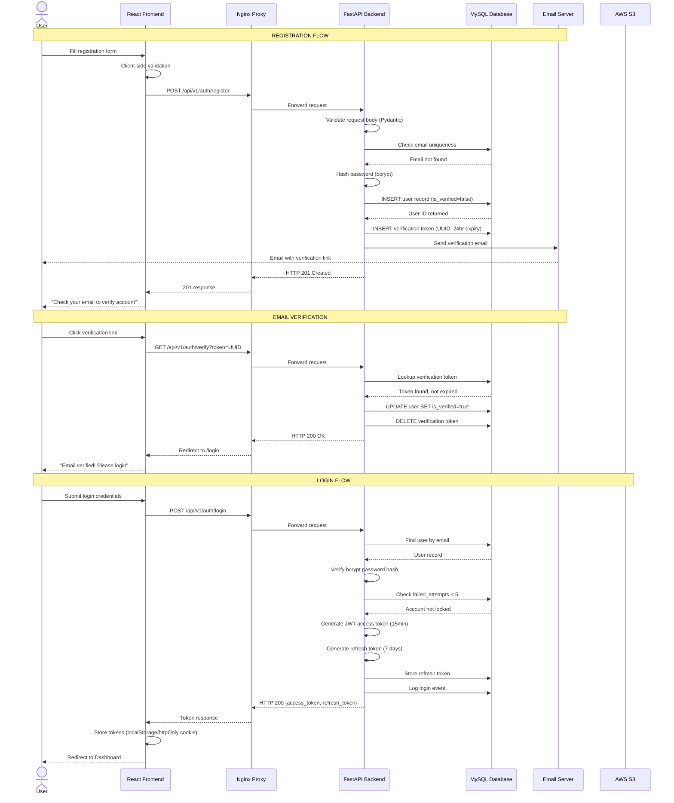

---

### 5.2.2 PDF Upload and Processing Sequence

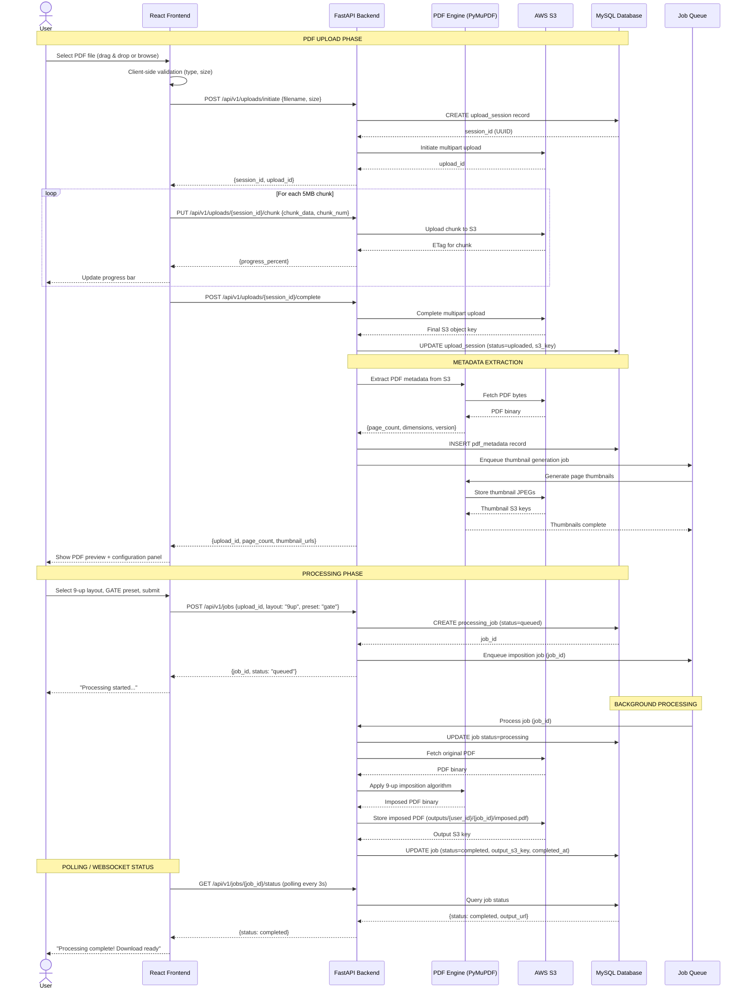

---

### 5.2.3 Download Sequence

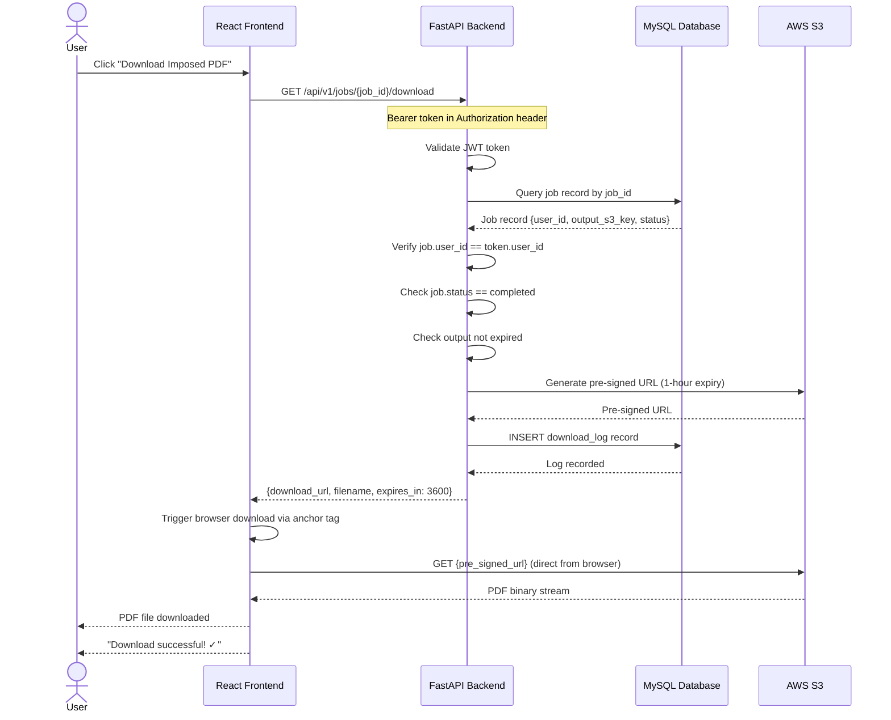

---

## 5.3 Activity Diagrams

### 5.3.1 Complete PDF Imposition Workflow Activity Diagram

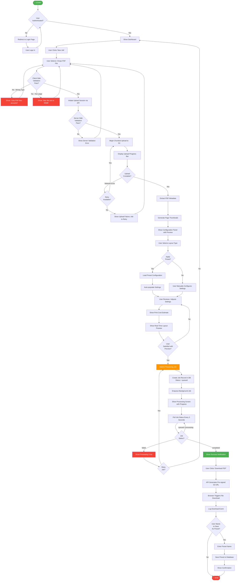

---

### 5.3.2 Imposition Algorithm Activity Diagram (9-Up Mode)

```mermaid
flowchart TD
    Start([🔵 START: Job Received]) --> FetchPDF[Fetch PDF from S3]
    FetchPDF --> ExtractPages[Extract All Pages using PyMuPDF]
    ExtractPages --> GetCount[Get Total Page Count N]

    GetCount --> CalcPad{N divisible\nby 18?}
    CalcPad -->|No| PadPages[Insert Blank Pages to reach\nnext multiple of 18]
    PadPages --> SetN[Update N = padded count]
    CalcPad -->|Yes| SetN

    SetN --> CalcSheets[Calculate Sheets = N / 18]
    CalcSheets --> InitOutput[Initialize Output PDF Document]

    InitOutput --> SheetLoop[For each Sheet s = 1 to Sheets]

    SheetLoop --> CalcGroup[Group start = s-1 * 18 + 1\nGroup end = s * 18]

    CalcGroup --> BuildFront[Build FRONT Side - 3x3 Grid]
    BuildFront --> FrontRow1[Row 1: page group+0, group+2, group+4]
    FrontRow1 --> FrontRow2[Row 2: page group+6, group+8, group+10]
    FrontRow2 --> FrontRow3[Row 3: page group+12, group+14, group+16]

    FrontRow3 --> CreateFrontPage[Create Front Sheet Page in Output PDF]
    CreateFrontPage --> PlaceFrontPages[Scale and Place 9 Pages\nin 3x3 Grid Positions]

    PlaceFrontPages --> BuildBack[Build BACK Side - 3x3 Grid - REVERSED]
    BuildBack --> BackRow1[Row 1: page group+5, group+3, group+1]
    BackRow1 --> BackRow2[Row 2: page group+11, group+9, group+7]
    BackRow2 --> BackRow3[Row 3: page group+17, group+15, group+13]

    BackRow3 --> CreateBackPage[Create Back Sheet Page in Output PDF]
    CreateBackPage --> PlaceBackPages[Scale and Place 9 Pages\nin 3x3 Grid - Reversed Order]

    PlaceBackPages --> ApplyMargins[Apply Configured Margins and Gutters]
    ApplyMargins --> AddPageNums{Page Numbers\nEnabled?}

    AddPageNums -->|Yes| DrawPageNums[Overlay Original Page Numbers\non Each Cell]
    DrawPageNums --> AddWatermark{Watermark\nEnabled?}

    AddPageNums -->|No| AddWatermark

    AddWatermark -->|Yes| DrawWatermark[Draw Watermark Text\nwith Opacity on Sheet]
    DrawWatermark --> MoreSheets{More Sheets\nRemaining?}

    AddWatermark -->|No| MoreSheets

    MoreSheets -->|Yes| SheetLoop
    MoreSheets -->|No| FinalizeOutput[Finalize and Save Output PDF]

    FinalizeOutput --> UploadS3[Upload Imposed PDF to S3]
    UploadS3 --> UpdateDB[Update Job Record\nstatus=completed, output_s3_key]
    UpdateDB --> End([🔴 END: Job Complete])

    style Start fill:#4CAF50,color:#fff
    style End fill:#f44336,color:#fff
    style PlaceFrontPages fill:#2196F3,color:#fff
    style PlaceBackPages fill:#9C27B0,color:#fff
    style FinalizeOutput fill:#FF9800,color:#fff
```

---

## 5.4 Data Flow Diagrams

### 5.4.1 Level 0 DFD — Context Diagram

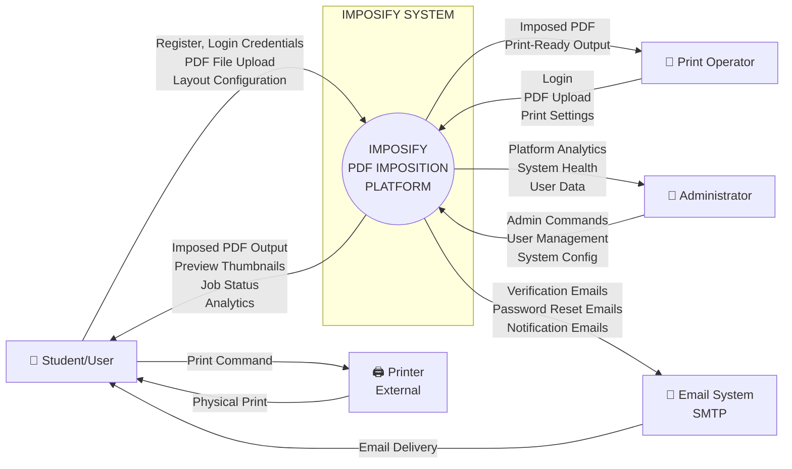

---

### 5.4.2 Level 1 DFD — System Processes

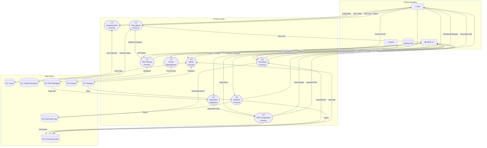

---

### 5.4.3 Level 2 DFD — PDF Processing Detail

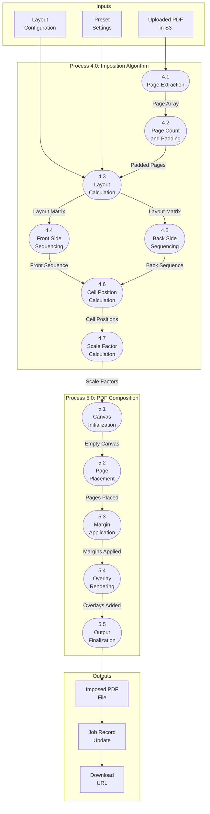

---

## 5.5 State Diagrams

### 5.5.1 Processing Job State Diagram

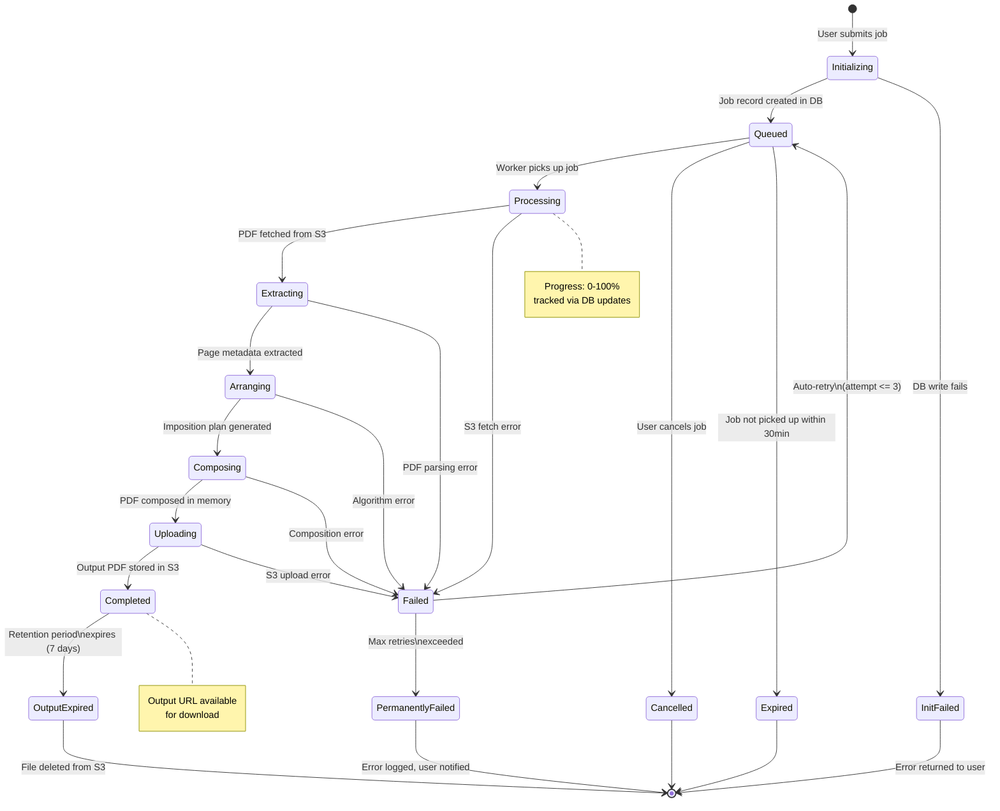

---

### 5.5.2 User Account State Diagram

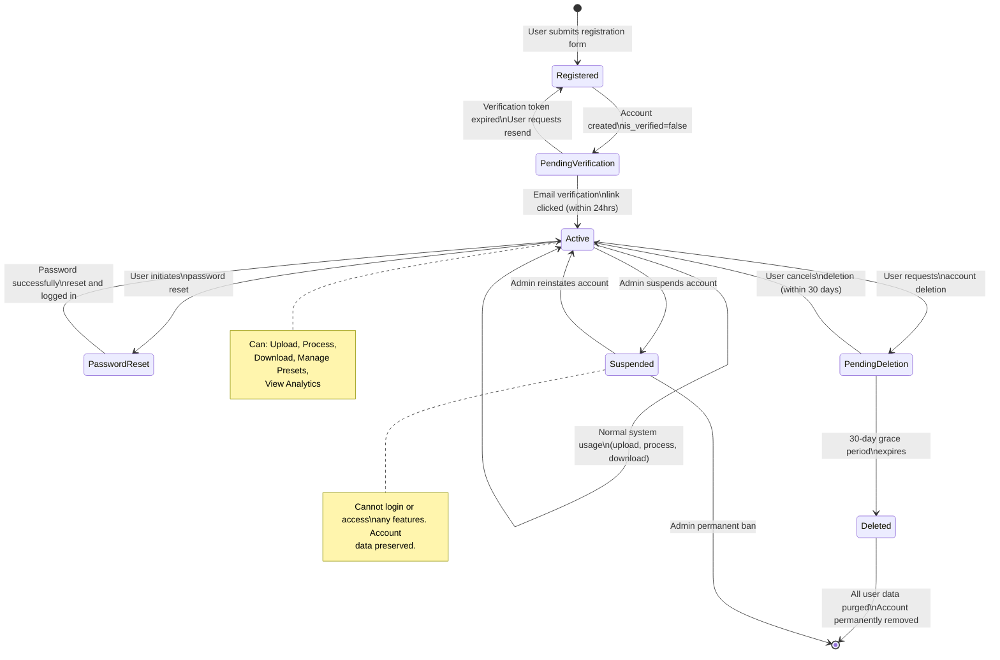

---

### 5.5.3 PDF Upload State Diagram

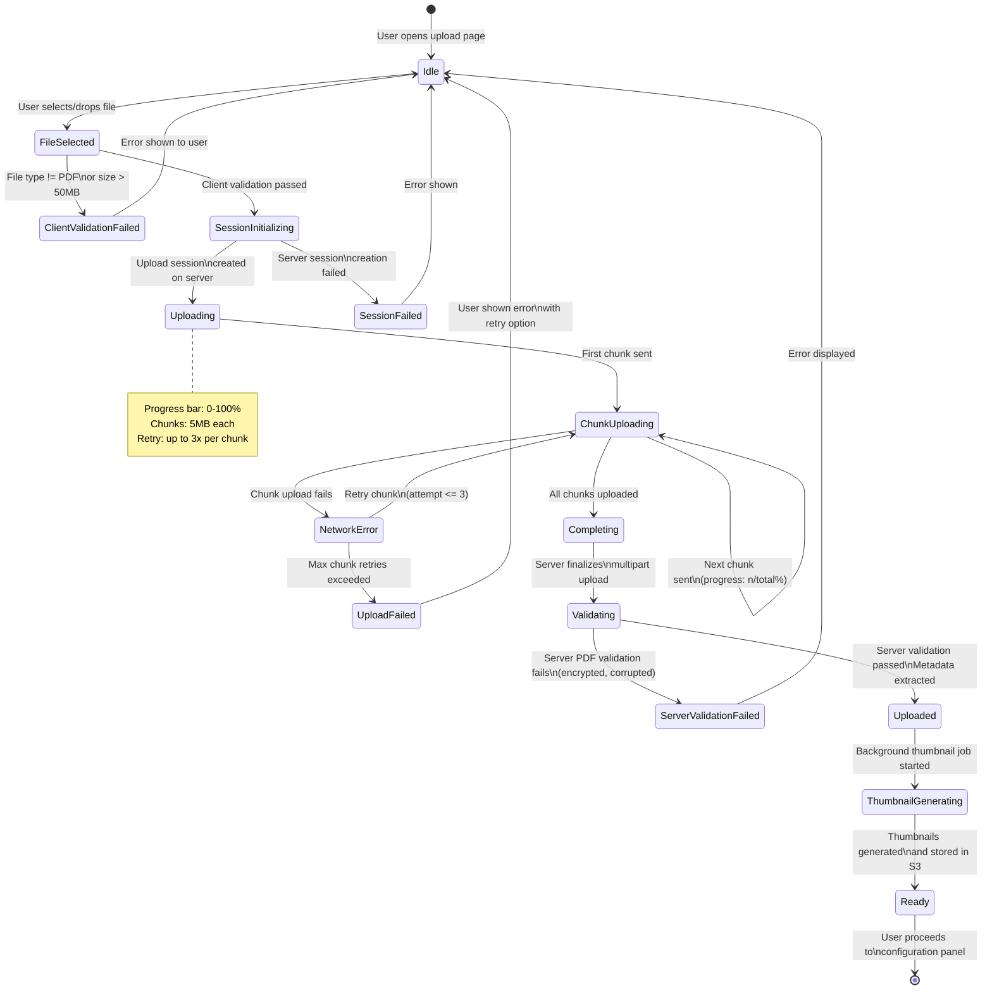

---

### 5.5.4 Authentication Token State Diagram

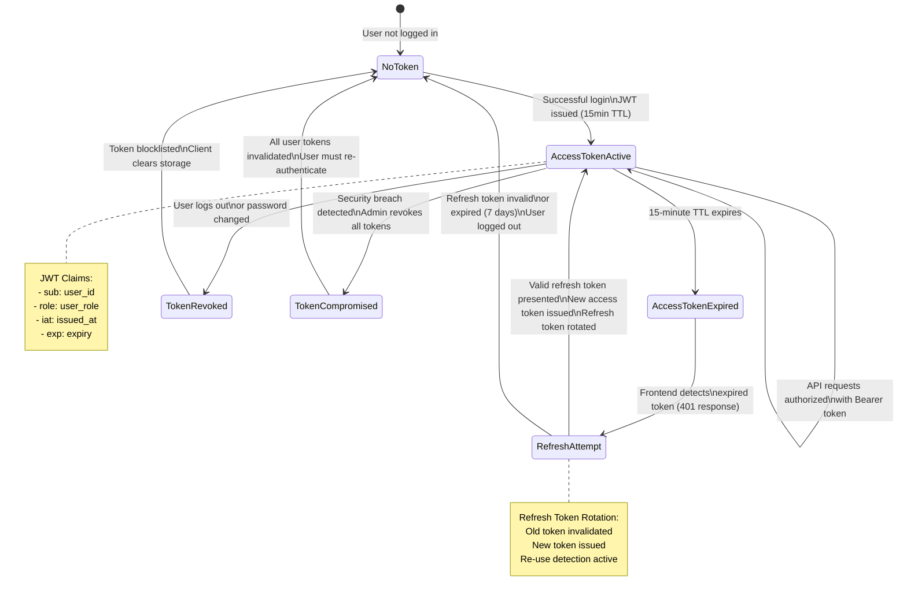

---

# SECTION 6: APPENDICES

---

## Appendix A: Database Schema Overview

```
DATABASE: imposify_db

TABLES:
━━━━━━━━━━━━━━━━━━━━━━━━━━━━━━━━━━━━━━━━━━━━━━━━━━━━━

TABLE: users
  id              CHAR(36) PK     UUID
  full_name       VARCHAR(100)
  email           VARCHAR(255)    UNIQUE
  password_hash   VARCHAR(255)    bcrypt
  role            ENUM(student, educator, print_operator, admin)
  is_verified     BOOLEAN         DEFAULT FALSE
  subscription    ENUM(free, pro, enterprise) DEFAULT free
  failed_attempts INT             DEFAULT 0
  locked_until    DATETIME        NULL
  created_at      DATETIME        DEFAULT NOW()
  updated_at      DATETIME
  deleted_at      DATETIME        NULL (soft delete)

TABLE: verification_tokens
  id          CHAR(36) PK
  user_id     CHAR(36) FK → users.id
  token       CHAR(36)    UNIQUE
  expires_at  DATETIME
  created_at  DATETIME

TABLE: refresh_tokens
  id          CHAR(36) PK
  user_id     CHAR(36) FK → users.id
  token_hash  VARCHAR(255)
  expires_at  DATETIME
  revoked_at  DATETIME NULL
  created_at  DATETIME

TABLE: pdf_uploads
  id              CHAR(36) PK
  user_id         CHAR(36) FK → users.id
  original_name   VARCHAR(255)
  s3_key          VARCHAR(500)
  file_size_mb    DECIMAL(8,2)
  status          ENUM(uploading, uploaded, failed)
  created_at      DATETIME

TABLE: pdf_metadata
  id              CHAR(36) PK
  upload_id       CHAR(36) FK → pdf_uploads.id
  page_count      INT
  pdf_version     VARCHAR(10)
  is_encrypted    BOOLEAN
  page_dimensions JSON
  created_at      DATETIME

TABLE: processing_jobs
  id              CHAR(36) PK
  user_id         CHAR(36) FK → users.id
  upload_id       CHAR(36) FK → pdf_uploads.id
  status          ENUM(queued,processing,completed,failed,cancelled)
  layout_type     ENUM(1up,2up,4up,8up,9up,booklet)
  preset_id       CHAR(36) NULL FK → presets.id
  config_json     JSON
  output_s3_key   VARCHAR(500) NULL
  output_size_mb  DECIMAL(8,2) NULL
  output_expired  BOOLEAN DEFAULT FALSE
  retry_count     INT DEFAULT 0
  error_message   TEXT NULL
  progress        INT DEFAULT 0
  queued_at       DATETIME
  started_at      DATETIME NULL
  completed_at    DATETIME NULL
  expires_at      DATETIME NULL

TABLE: presets
  id          CHAR(36) PK
  user_id     CHAR(36) NULL FK → users.id (NULL = system preset)
  name        VARCHAR(100)
  is_system   BOOLEAN DEFAULT FALSE
  config_json JSON
  created_at  DATETIME

TABLE: download_logs
  id          CHAR(36) PK
  user_id     CHAR(36) FK → users.id
  job_id      CHAR(36) FK → processing_jobs.id
  downloaded_at DATETIME

TABLE: auth_logs
  id          CHAR(36) PK
  user_id     CHAR(36) FK → users.id
  event_type  ENUM(login, logout, password_change, token_refresh)
  ip_address  VARCHAR(45)
  user_agent  TEXT
  created_at  DATETIME
```

---

## Appendix B: API Endpoint Summary

```
BASE URL: https://api.imposify.app/api/v1

AUTHENTICATION ENDPOINTS:
━━━━━━━━━━━━━━━━━━━━━━━━━━━━━━━━━━━━━━━━━━━━
POST   /auth/register              FR-AUTH-001
GET    /auth/verify                FR-AUTH-002
POST   /auth/login                 FR-AUTH-003
POST   /auth/refresh               FR-AUTH-004
POST   /auth/forgot-password       FR-AUTH-005
POST   /auth/reset-password        FR-AUTH-006
POST   /auth/logout                FR-AUTH-007

USER ENDPOINTS:
━━━━━━━━━━━━━━━━━━━━━━━━━━━━━━━━━━━━━━━━━━━━
GET    /users/me                   FR-USR-001
PATCH  /users/me                   FR-USR-002
GET    /users/me/history           FR-USR-003
DELETE /users/me                   FR-USR-004
GET    /users/me/subscription      FR-USR-005

UPLOAD ENDPOINTS:
━━━━━━━━━━━━━━━━━━━━━━━━━━━━━━━━━━━━━━━━━━━━
POST   /uploads/initiate           FR-UPL-003
PUT    /uploads/{id}/chunk         FR-UPL-003
POST   /uploads/{id}/complete      FR-UPL-003
GET    /uploads/{id}/status        FR-UPL-004
GET    /uploads/{id}/metadata      FR-PROC-001
GET    /uploads/{id}/thumbnails    FR-PRV-001

JOB ENDPOINTS:
━━━━━━━━━━━━━━━━━━━━━━━━━━━━━━━━━━━━━━━━━━━━
POST   /jobs                       FR-PROC-006
GET    /jobs/{id}/status           FR-PROC-006
GET    /jobs/{id}/download         FR-DWN-001
GET    /jobs                       FR-USR-003
DELETE /jobs/{id}                  Admin/User

PRESET ENDPOINTS:
━━━━━━━━━━━━━━━━━━━━━━━━━━━━━━━━━━━━━━━━━━━━
GET    /presets                    FR-PRE-006
POST   /presets                    FR-PRE-005
GET    /presets/{id}               FR-PRE-006
PATCH  /presets/{id}               FR-PRE-006
DELETE /presets/{id}               FR-PRE-006

ANALYTICS ENDPOINTS:
━━━━━━━━━━━━━━━━━━━━━━━━━━━━━━━━━━━━━━━━━━━━
GET    /analytics/dashboard        FR-ANL-001
GET    /analytics/savings          FR-ANL-002

ADMIN ENDPOINTS:
━━━━━━━━━━━━━━━━━━━━━━━━━━━━━━━━━━━━━━━━━━━━
GET    /admin/users                FR-ADM-001
PATCH  /admin/users/{id}           FR-ADM-001
GET    /admin/jobs                 FR-ADM-002
PATCH  /admin/jobs/{id}            FR-ADM-002
GET    /admin/analytics            FR-ADM-003
GET    /health                     FR-ADM-004
```

---

## Appendix C: Requirements Traceability Matrix

```
REQ ID          | Module            | Priority  | FR/NFR | Status
━━━━━━━━━━━━━━━━━━━━━━━━━━━━━━━━━━━━━━━━━━━━━━━━━━━━━━━━━━━━━━━━
FR-AUTH-001     | Authentication    | Critical  | FR     | Defined
FR-AUTH-002     | Authentication    | Critical  | FR     | Defined
FR-AUTH-003     | Authentication    | Critical  | FR     | Defined
FR-AUTH-004     | Authentication    | Critical  | FR     | Defined
FR-AUTH-005     | Authentication    | High      | FR     | Defined
FR-AUTH-006     | Authentication    | High      | FR     | Defined
FR-AUTH-007     | Authentication    | High      | FR     | Defined
FR-AUTH-008     | Authentication    | Critical  | FR     | Defined
FR-USR-001      | User Management   | High      | FR     | Defined
FR-USR-002      | User Management   | Medium    | FR     | Defined
FR-USR-003      | User Management   | Medium    | FR     | Defined
FR-USR-004      | User Management   | Low       | FR     | Defined
FR-USR-005      | User Management   | Low       | FR     | Defined
FR-UPL-001      | Upload            | Critical  | FR     | Defined
FR-UPL-002      | Upload            | Critical  | FR     | Defined
FR-UPL-003      | Upload            | Critical  | FR     | Defined
FR-UPL-004      | Upload            | High      | FR     | Defined
FR-UPL-005      | Upload            | Medium    | FR     | Defined
FR-PRV-001      | Preview           | High      | FR     | Defined
FR-PRV-002      | Preview           | High      | FR     | Defined
FR-PRV-003      | Preview           | High      | FR     | Defined
FR-PROC-001     | Processing        | Critical  | FR     | Defined
FR-PROC-002     | Processing        | Critical  | FR     | Defined
FR-PROC-003     | Processing        | Critical  | FR     | Defined
FR-PROC-004     | Processing        | Critical  | FR     | Defined
FR-PROC-005     | Processing        | High      | FR     | Defined
FR-PROC-006     | Processing        | Critical  | FR     | Defined
FR-PROC-007     | Processing        | Medium    | FR     | Defined
FR-PROC-008     | Processing        | Medium    | FR     | Defined
FR-PROC-009     | Processing        | Critical  | FR     | Defined
FR-LAY-001      | Layout            | Critical  | FR     | Defined
FR-LAY-002      | Layout            | Medium    | FR     | Defined
FR-LAY-003      | Layout            | Medium    | FR     | Defined
FR-LAY-004      | Layout            | Low       | FR     | Defined
FR-LAY-005      | Layout            | Medium    | FR     | Defined
FR-DWN-001      | Download          | Critical  | FR     | Defined
FR-DWN-002      | Download          | Low       | FR     | Defined
FR-DWN-003      | Download          | Medium    | FR     | Defined
FR-PRE-001      | Preset            | High      | FR     | Defined
FR-PRE-002      | Preset            | High      | FR     | Defined
FR-PRE-003      | Preset            | High      | FR     | Defined
FR-PRE-004      | Preset            | Medium    | FR     | Defined
FR-PRE-005      | Preset            | Medium    | FR     | Defined
FR-PRE-006      | Preset            | Medium    | FR     | Defined
FR-ANL-001      | Analytics         | Medium    | FR     | Defined
FR-ANL-002      | Analytics         | Low       | FR     | Defined
FR-ADM-001      | Admin             | High      | FR     | Defined
FR-ADM-002      | Admin             | High      | FR     | Defined
FR-ADM-003      | Admin             | Medium    | FR     | Defined
FR-ADM-004      | Admin             | High      | FR     | Defined
NFR-PERF-001..8 | Performance       | High      | NFR    | Defined
NFR-SCAL-001..6 | Scalability       | High      | NFR    | Defined
NFR-AVAIL-001..5| Availability      | High      | NFR    | Defined
NFR-REL-001..6  | Reliability       | High      | NFR    | Defined
NFR-MAIN-001..8 | Maintainability   | Medium    | NFR    | Defined
NFR-SEC-001..12 | Security          | Critical  | NFR    | Defined
NFR-USE-001..6  | Usability         | High      | NFR    | Defined
NFR-ACC-001..6  | Accessibility     | Medium    | NFR    | Defined
NFR-PORT-001..5 | Portability       | Medium    | NFR    | Defined
NFR-COMP-001..6 | Compliance        | High      | NFR    | Defined
```

---

```
━━━━━━━━━━━━━━━━━━━━━━━━━━━━━━━━━━━━━━━━━━━━━━━━━━━━━━━━━━━━━━━━

 IMPOSIFY - SOFTWARE REQUIREMENTS SPECIFICATION
 Document ID  : IMPOSIFY-SRS-2025-001
 Version      : 1.0.0
 Standard     : IEEE Std 830-1998

 Total Functional Requirements  : 51
 Total Non-Functional Requirements: 50+
 Total Diagrams                 : 10 (Mermaid)
 Total Modules Specified        : 10

 END OF DOCUMENT

━━━━━━━━━━━━━━━━━━━━━━━━━━━━━━━━━━━━━━━━━━━━━━━━━━━━━━━━━━━━━━━━
```